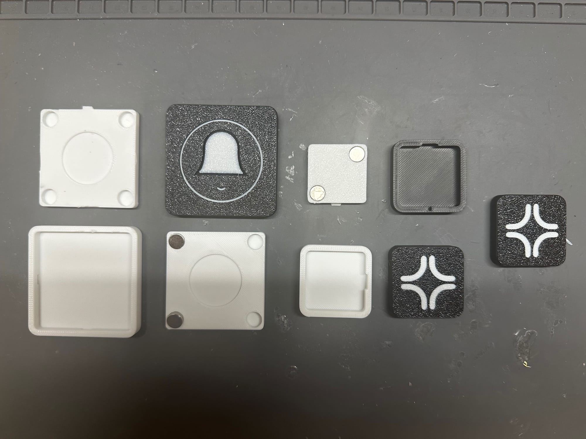
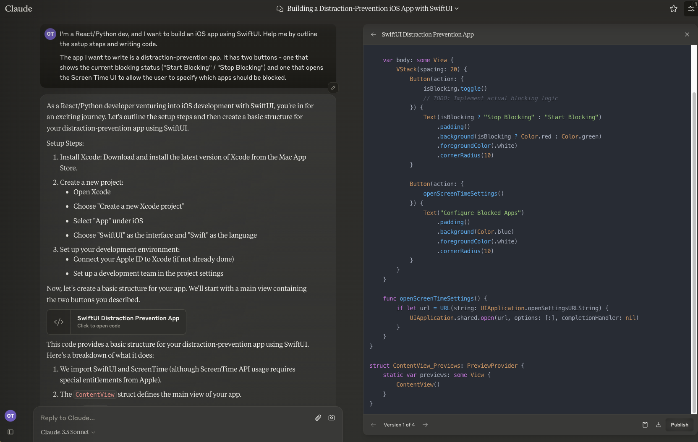
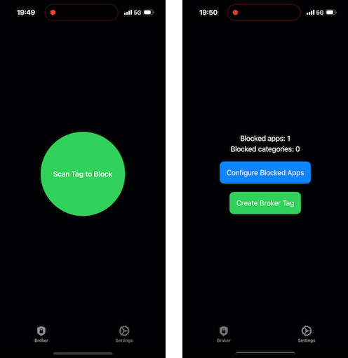
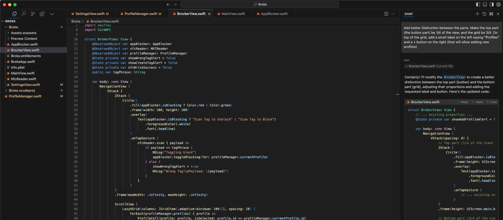
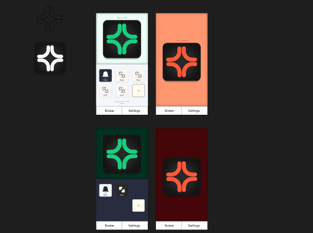

I recently came across a nifty little project called [Brick](https://getbrick.app). Brick is a simple yet powerful product - it's a physical tag that allows you (using a dedicated iOS app) to block certain apps an activities on your phone, with unlocking only possible by using the physical tag that was used to lock them.

The idea behind this workflow is to enable you to create a physical barrier that keeps you from engaging with distractions on your phone - for example, you can use the Brick to block all non-vital apps on your phone before going to the coffee shop to get some work done. Once you've left the tag at home, you cannot be tempted into disabling the block - as you simply cannot disable it until you get back home and has the tag available again.

When I first discovered Brick, I was intrigued by its concept - However, as much as I liked the idea, I felt that Brick had more features than I personally needed—and I wasn't keen on paying 50$ for something I felt I can hack together in a weekend. So instead of paying, I decided to do just that - build my own alternative, aptly named **Broke**.

> This is a good opportunity to give a shoutout to the Brick team - if this concept seems valuable to you, I highly recommend checking them out - their app has a lot of features I didn't bother implementing, and the experience they provide is much more production ready.

## From Concept to Reality: Creating Broke

To get started, I ordered some affordable NFC tags from AliExpress. I initially ordered ones that matched the ones used by Brick, but later I've decided to make my app stand on it's own completely, and wrote the code to support any NFC tag supported by iOS.

I also spent some time creating a 3D Printed case, to allow for a sleek experience. After a few iterations, I built a case that had magnet holes (to allow leaving it on the fridge) and a keychain hole, to allow carrying it around.

*It took multiple tries, but I'm really happy with the end product*

## Writing the iOS app, with a little help

Once I had a physical tag and a case, it was time to write the app that would implement the real functionality. There was only a tiny problem - I had zero experience with iOS development.

However, I did had a good idea of how I wanted the app to work. I knew that it would need to support reading and writing NFC tags (to allow the interaction of scanning a tag to trigger an action), and that it would have to interface with the Screen Time APIs that iOS exposed to allow developers to limit interaction with other apps.

Armed with this outline, I embarked on a quest that I suspect would be my first foray into the future of programming, and how it's gonna look like for all code projects in the not so distant future - pair programming with AI. I used Claude, my LLM of choice, to start building the user interface.

Working with Claude was great - I was quickly able to put a basic PoC that allowed me to demonstrate that the app worked.

*The Proof of concept design*

But the real game changer was when I followed a recommendation from a fellow developer on Twitter - which prompted me to start using [Cursor](https://www.cursor.com/) - a VS Code-based AI IDE allowed me to "talk" with my codebase (using embeddings), which made understanding and navigating the code so much easier. With Cursor, I was able to quickly transform my basic proof of concept into a functional, polished app—something that actually feels like it could belong on the App Store.

## Final Touches

Once I was done with the core functionality, I took some time to design something that would look presentable. I never designed for iOS before, but after playing in Figma for a while I got to result I was OK with. If this was a full time product, I'd probably give it some more refinement - but for a pet-project, this was good enough.

This is how the final experience looks like:

![[iphone-nfc-scan-ready.mp4|poster=iphone-nfc-scan-ready-poster.png]]

## Sharing Broke

I want to share my project with the world, but releasing a free alternative to Brick will be what people in bird culture refer to as a dick move.

Therefor, I won't be releasing Broke as an app anyone can download, nor will I be letting people buy Broke tags from me - Instead, I've open-sourced the project, to make it available as an option for technical folks like me, or for anyone interested in building upon my work.

The code for the app is available on [Github](https://github.com/OzTamir/broke/tree/main?tab=readme-ov-file), while the design for the tags is available on [Printables](https://www.printables.com/model/983618-broke-tag-nfc-tag-cover-with-keychain-and-magnet-h).

## Conclusion

Now that the project is complete, I’m thrilled with the outcome. I have created the product that I wanted to use, and I did so by using my own code, CAD, and 3D printing skills. Here's how it turned out:

Reflecting upon this project, I must say that It never ceases to amaze me how much power a modern-day hobbyists have on their hands - I was able to create this thing from scratch over a weekend! Amazing. Also, I feel like this experience is my answer to folks saying that programming will be gone in a couple of years - I don't think that programmers will be replaced by AI. I think that the programmers who will fail to embrace the possibilities unlocked by AI will be left behind, but those of us who will - are about to unlock abilities beyond their wildest imagination.

Exciting times!
