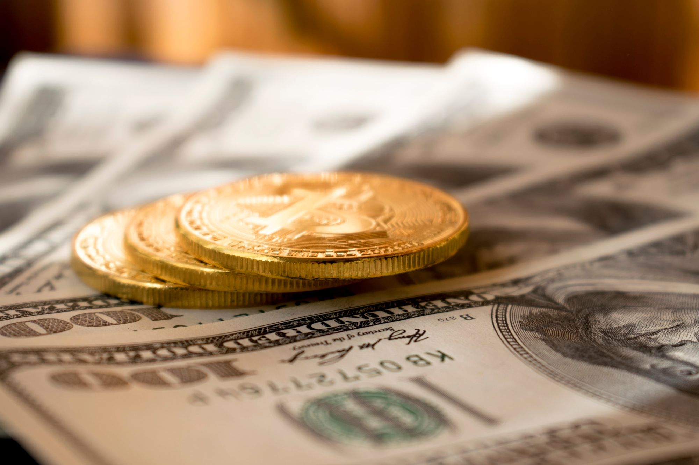
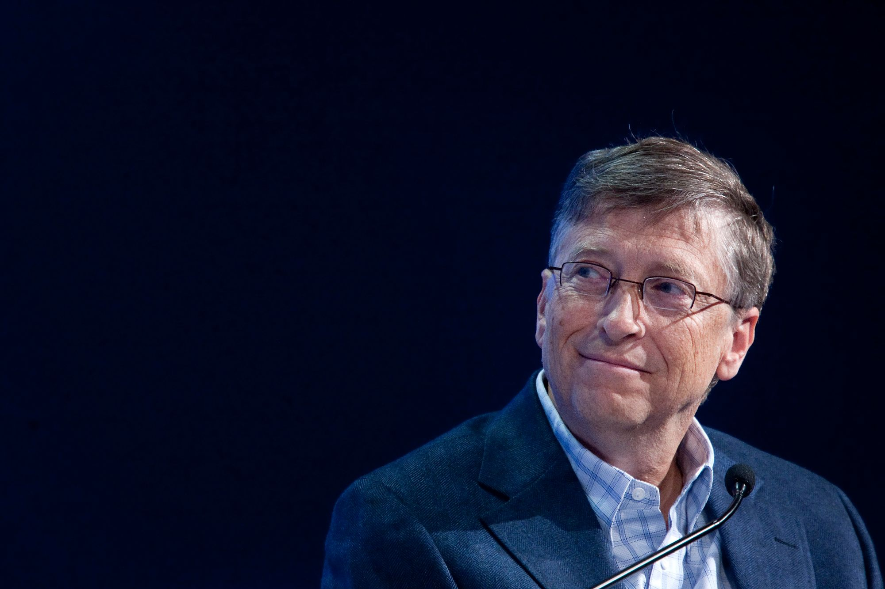
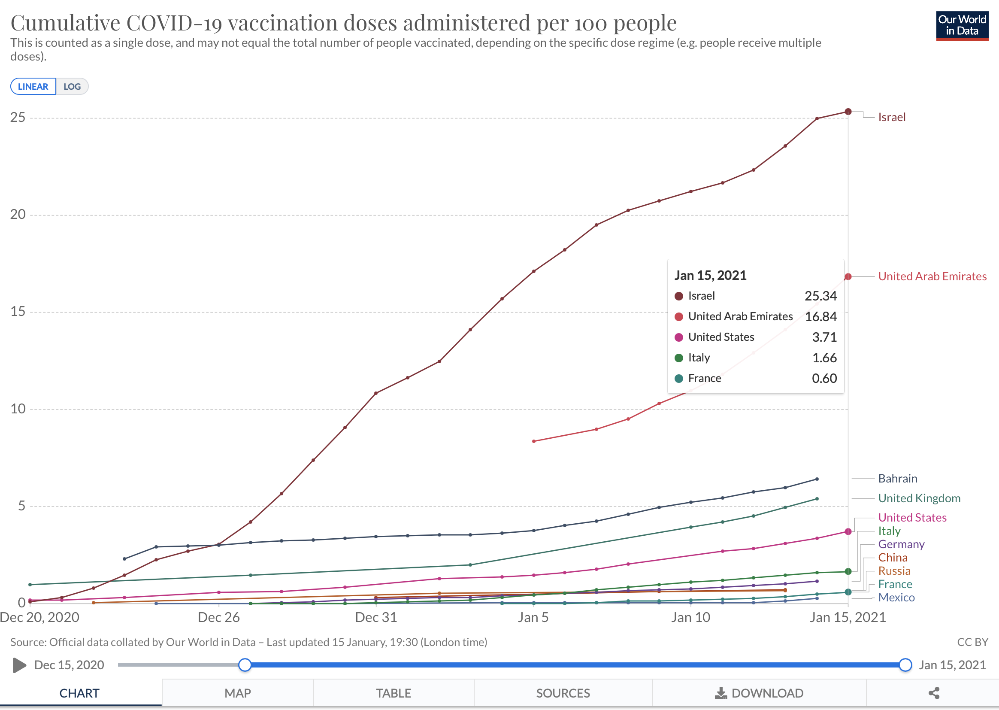
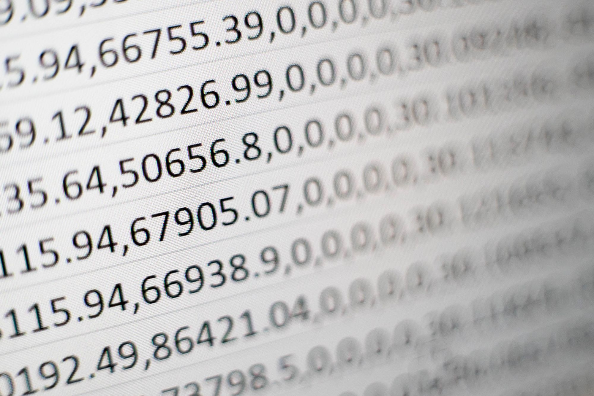

As the last couple of weeks had shown, the value and market cap of digital currencies is expanding. BitCoin, Ethereum, and other cryptocurrencies are all on the rise. People are calling Bitcoin “[the new gold](https://www.ft.com/content/608acefb-22ca-44e2-a438-2d874b37d695)”.

But amongst these digital coins there is one that stood up and had recently crossed the line from the virtual world to the real world. One that has been steadily growing over the past 20 years, without any Bitcoin-like [hiccups](https://www.businesstoday.in/markets/commodities/bitcoin-rally-halts-falls-over-17-from-record-high-of-34800/story/426948.html), and has successfully transitioned to a digital coin for the masses - one that is used by almost every citizen of the digital world.

I'm talking, of course, about the digital currency that my grandma uses to pay for her email, social interactions, and TV watching - data.

## Content is king

In 1996, Bill Gates coined the phrase “Content is king”. In an [essay](https://medium.com/@HeathEvans/content-is-king-essay-by-bill-gates-1996-df74552f80d9) published on Microsoft's website, he made the following prediction:

> Content is where I expect much of the real money will be made on the Internet, just as it was in broadcasting.

In addition, he also later predicted that:

> For the Internet to thrive, content providers must be paid for their work. The long-term prospects are good, but I expect a lot of disappointment in the short-term as content companies struggle to make money through advertising or subscriptions. It isn’t working yet, and it may not for some time.

In these predictions, and throughout the rest of his essay, Bill argues that the way he envisions the revenue model of the internet is centered around a capitalist market of content. In his perceived world, each company in a given market would open a paywalled service, and the power of a free market would reward the best offering with the most income. As he says in the quoted section, he believes that most advertising based revenue models will fail, at least for the time being.

However, despite this article being a milestone in the internet’s quest to become profitable, he got one thing wrong - the difference between print or televised advertising and digital advertising. In his words:

> In the long run, advertising is promising. An advantage of interactive advertising is that an initial message needs only to attract attention rather than convey much information. A user can click on the ad to get additional information-and an advertiser can measure whether people are doing so.

And that's where he was mistaken, for the difference is so much more than only interactivity- for content is no king, but merely a prince. The real king, of course, is data.

## Rich, but not as in money-rich

On November 9th, Pfizer and BioNTech [announced](https://www.pfizer.com/news/press-release/press-release-detail/pfizer-and-biontech-announce-vaccine-candidate-against) that their COVID-19 vaccine was found to be 90% successful (the final figures were higher - [around 95%](https://edition.cnn.com/2020/11/18/health/pfizer-coronavirus-vaccine-safety/index.html)). This achievement was celebrated around the world, as it signaled the light at the end of the coronavirus crisis tunnel. However, it also ignited a cold war between the nations of the world - as it was with any limited resource throughout history. Everyone wanted to put an end to the pandemic as soon as possible, and so everyone raced to get millions of vaccines from Pfizer.

However, more than a month after the vaccine got [approved by the FDA](https://www.fda.gov/media/144412/download), the vaccination perctange in most western countries is shocking low: Germany is at 950,000 doses given, while France is at mere 350,000 doses. In the US, only 13% are vaccinated. Vaccines are hard to come by, and the pandemic rages on.

There is, however, an exception. A country where today, merely a month since the vaccination operation had begun, every forth person had received at least the first dose (out of two) - Israel.

*Data taken from ourworldindata.org*

But wait. How did Israel, which isn’t an exceptionally rich country, had managed to outrace much richer countries in the race to get vaccines - how could it have signed a deal with Pfizer to promise that the entire eligible (Pfizer is yet to get FDA approval for vaccination of individuals under the age of 16) population will be have received the vaccine by March?

Well, that is because Israel is a much richer state than most of the others mentioned - but not with the traditional currencies. Israel, and especially it’s healthcare system, is rich with the digital currency of the new age - data.

You see, the deal signed by Israel and Pfizer isn’t about money, [it’s about data](https://www.politico.eu/article/israel-coronavirus-vaccine-success-secret/) - the deal included an agreement to share health information about the recipients of Pfizer’s vaccine. That agreement will, in fact, turn Israel into a giant Pfizer experiment. That is not to say that I think that Pfizer’s vaccine isn’t safe of course, but one of the major concerns raised about it was the speed at which it was approved for administration.

This agreement will allow Pfizer to receive information about the long term effects that it vaccine has, thanks to the very developed Israeli healthcare system, in which the medical history of every Israeli citizen is highly documented - which would allow Pfizer to trace any side effect and study what might cause these. At the end, this study would allow Pfizer to release better information about who should or shouldn’t take the vaccine, making the side effect less common.

## A currency for the new age

At the end, this deal signals another milestone in the process of data becoming a real, tangible currency. Today, many of the countries that are considered wealthy are basing that wealth over a natural resource - gas, oil, gold or any other physical material that can be mined or extracted from the plant.

But as our lives become more and more reliant on our digital identities, I think that more and more global entities - be it governments, tech giants or individual people - will start to realize that personal data is an untapped natural resource, and that just as gold can be mined from the ground for profit, so can data be mined for a financial gain.

Be it a car insurance company that will give you a discount if [you hand in information about your driving habits](https://www.marketwatch.com/story/should-you-let-your-car-insurer-monitor-you-2019-03-27), medical companies that will give your country faster access to vaccines in exchange for medical records, or social networks that will use your preferences to give you [targeted advertisements](https://www.vox.com/2018/4/11/17177842/facebook-advertising-ads-explained-mark-zuckerberg) - our data is a currency that we own, and as the services we use will start accept it more often and will use it in more and more ways, we might want to start keeping track of where we’re spending it.

We’ve seen enough Black Mirror episodes to know what will happen if we won’t.
