A few months ago, I noticed that the lightning at my workstation at my home office wasn’t that great - I realized that whenever I take a call from here, it looks bad. So, like every influencer, I quickly made my way to Amazon and purchased a simple, cheap, selfie-style ring light.


It arrived, and I was pretty happy with it -—the light quality was good, and it definitely improved the appearance of my video calls.  
  
But there was one tiny problem: I kept forgetting to turn it on before joining calls. First-world problems, right?

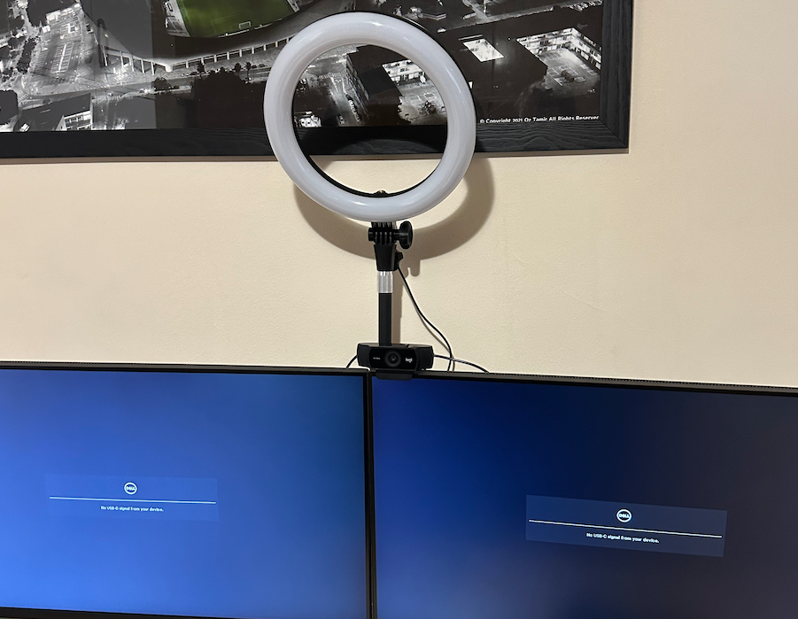

That's when my tinkerer's brain kicked into high gear. I thought, "Wouldn't it be cool if this light could turn on automatically when I start a video call?" And just like that, a simple Amazon purchase turned into a full-blown DIY project.

## Taking it apart

First things first - before I could connect it to anything, I needed to understand how it is being controlled. The light came with a simple controller equipped with four buttons:

1.  On/Off button
2.  Buttons to increase or decrease brightness
3.  A button to change the color temperature - the ring light supported 3 modes: Cold white, Warm white, and natural white (which was somewhat in the middle of the other two options)

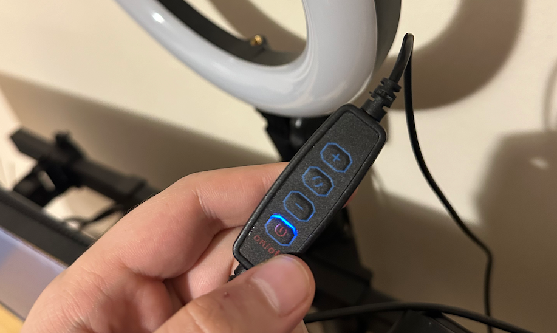

To get things started, I used a screwdriver to open the controller:

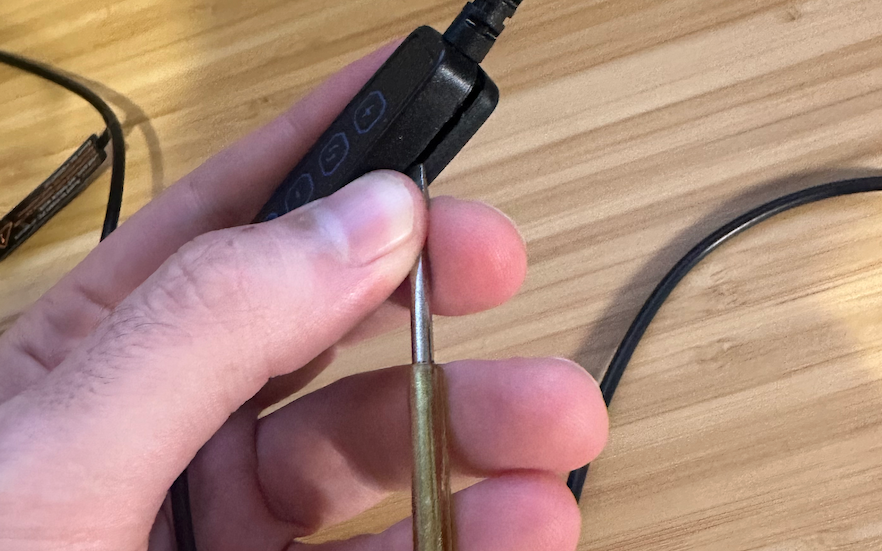

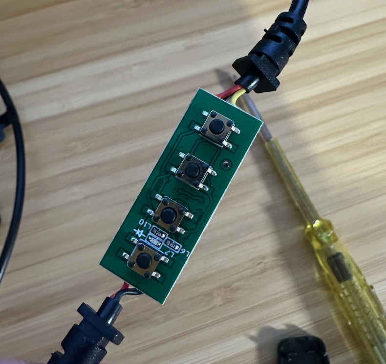

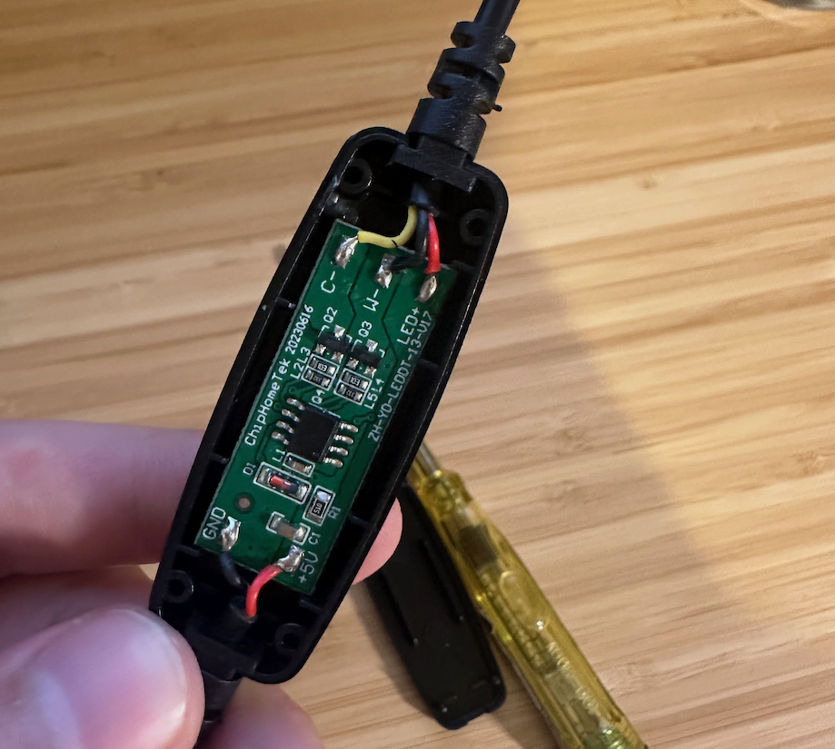

With the light disassembled and the controller pried open, I found myself staring at a small green PCB. The board had a few components that caught my eye:

-   A small chip that I assumed was the brains of the operation.
-   Various tiny surface-mount components scattered across the board.
-   Some clearly labeled connection points.

From the USB input side, the wires were straightforward - `5V+` red wire, and `GND` black wire - easy. The other side was a bit trickier - with wires labeled `C-` (Yellow), `W-` (Black), and `LED+` (Red).  
  
This is a good opportunity to remind you that I don’t have any background in electrical engineering - while I understand the basic concepts, I don't have a deep understanding of the field - which meant that all these markings made zero sense to me.  
  
Another thing that caught my eye was the serial number on the PCB - `ZH-YD-LEDDT-13-V17`. This gave me some hope - maybe I could find the data-sheet for this controller, which would explain how the light should be controlled?  
  
I looked it up - but alas, no data sheet was found. I did find [this](https://yoshizen.wordpress.com/tag/led-ring-light/) blog post, which seemed to be dealing with the same ring light - but did not explain the control protocol. Bummer.  
  
Googling some more, I came across [this](https://www.reddit.com/r/led/comments/o8netf/help_with_identifying_and_controlling_a_selfie/) Reddit post - while it looked like the poster in this case had a more advanced version of my ring light, the comments there were helpful - it made me realize that the light is likely controlled via PWM. I just needed to figure out which wire was which - and I would be golden!

> PWM, or Pulse Width Modulation, is a technique commonly used to control the brightness of LEDs or the speed of motors. It's a way of simulating an analog signal using digital pulses.  
>   
> Here's how it works:  
> 1\. Instead of varying the voltage continuously (which would be an analog signal), PWM rapidly switches the power on and off.  
> 2\. The ratio of "on" time to "off" time in each cycle is called the duty cycle.  
> 3\. By varying the duty cycle, we can control the average power delivered to the LED, thus controlling its brightness.  
>   
> For example:  
> – A 50% duty cycle means the signal is on half the time, resulting in medium brightness.  
> – A 75% duty cycle means the signal is on 75% of the time, resulting in higher brightness.  
> – A 25% duty cycle means the signal is on 25% of the time, resulting in lower brightness.

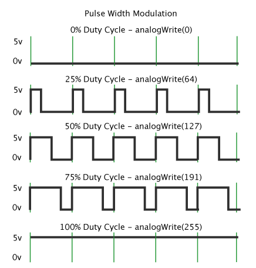

Armed with knowledge, I decided that the best way forward would be to desolder the PCB, hook the light directly to an Arduino or an ESP32, and just play with the pins until I figured out what was going on.

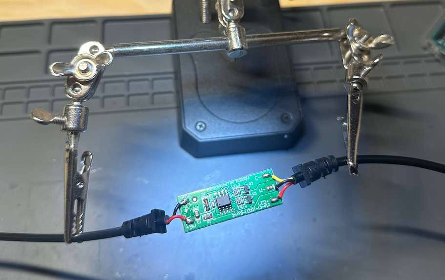

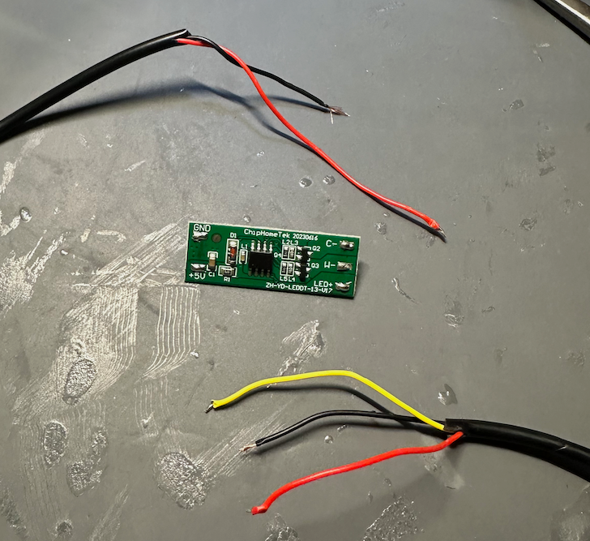

To connect it properly to the ESP32, I took the raw wires and used a crimping kit to put them inside easily usable plastic pins. It was my first time doing this, and I’m delighted with how it turned out - it made the connection to the ESP32 **much easier**.

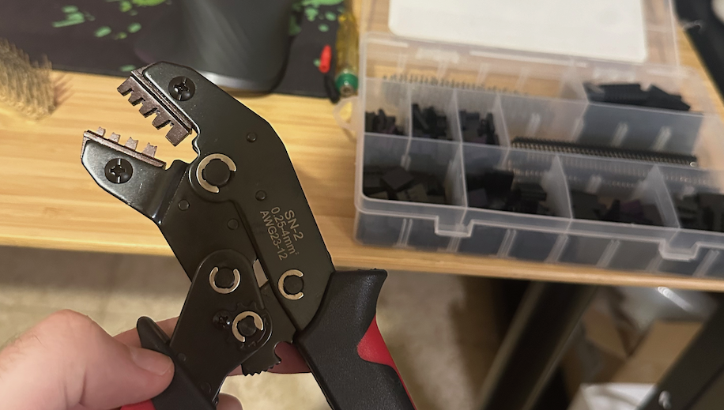

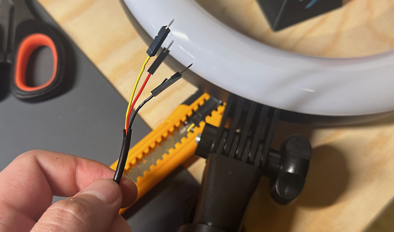

## Debugging with Claude.ai

Once I had all the wires connected, I decided that this would be a good opportunity to test out the hottest LLM in the market right now, the `Claude 3.5 Sonnet` model by [Claude.ai](https://claude.ai).  
  
I started by telling it my problem, and had it help me debug.

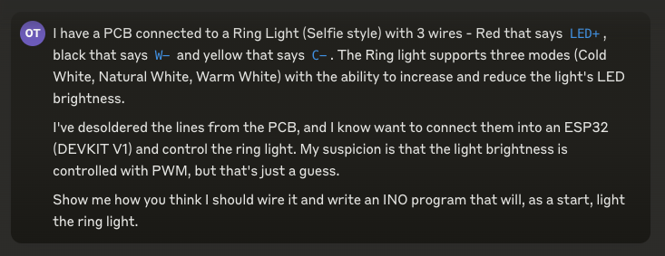

Sonnet did not disappoint. It gave me not only the code for the ESP, but also a wiring diagram, which came in really handy!

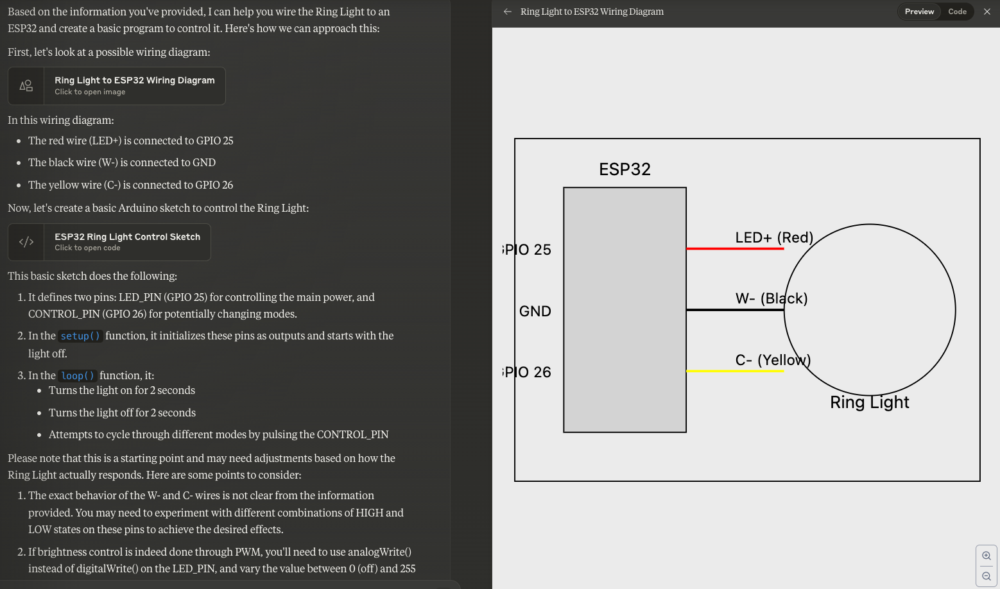

This began a cycle of debugging, with Sonnet as my pair-programmer. I must say that the whole experience was delightful - I kept toying around with the code it supplied me with, and it kept improving it based on my feedback:

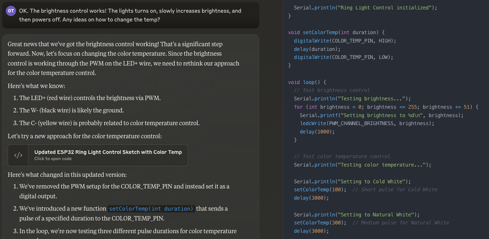

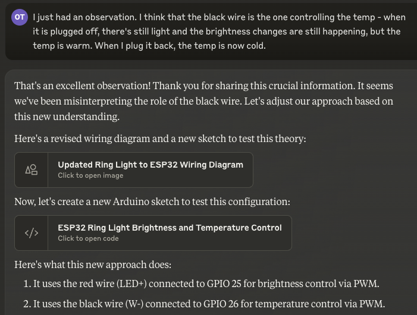

  
After some back and forth, I had an idea - I asked Sonnet to create a Web server that would let me dynamically play with the values that the ESP was outputting via PWM:

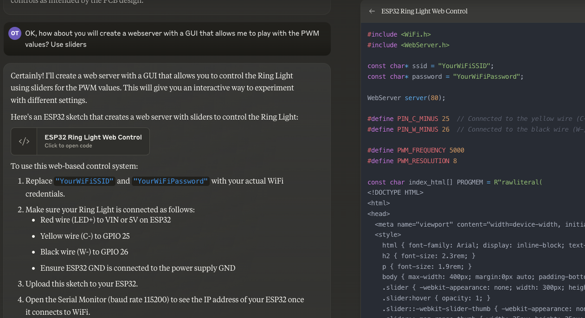

The UI was simple, but it did the trick:


After playing with it and trying to understand the effect of changing each scale, I finally figured it out!  
  
The ring light is made out of two separate sets of LEDs - half are cold white, and half are warm white. The wire labeled `C-` is the cold light, and the wire labeled `W-` is the warm white. Combining both of them gives out natural white.  
  
That was it! Excited, I shared the news with Sonnet:

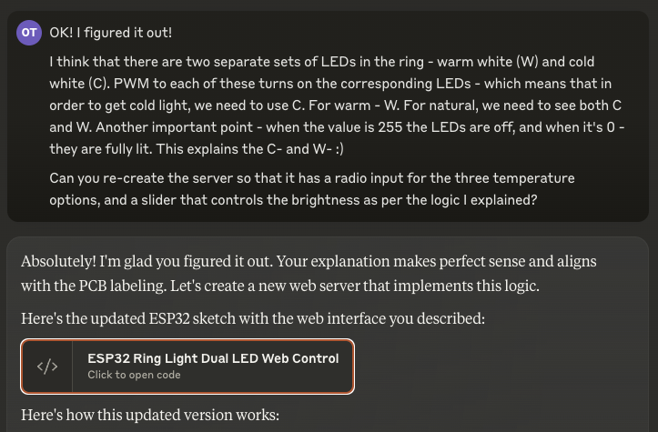

The code was pretty simple:

```
#include <WiFi.h>
#include <WebServer.h>

WebServer server(80);

#define PIN_C_MINUS 25  // Connected to the yellow wire (C-) for cold white LEDs
#define PIN_W_MINUS 26  // Connected to the black wire (W-) for warm white LEDs

#define PWM_FREQUENCY 5000
#define PWM_RESOLUTION 8

const char index_html[] PROGMEM = (...);

void setup() {
  Serial.begin(115200);
  
  ledcSetup(0, PWM_FREQUENCY, PWM_RESOLUTION);
  ledcSetup(1, PWM_FREQUENCY, PWM_RESOLUTION);
  
  ledcAttachPin(PIN_C_MINUS, 0);
  ledcAttachPin(PIN_W_MINUS, 1);

  WiFi.begin(ssid, password);
  while (WiFi.status() != WL_CONNECTED) {
    delay(1000);
    Serial.println("Connecting to WiFi...");
  }
  Serial.println("Connected to WiFi");
  Serial.print("IP address: ");
  Serial.println(WiFi.localIP());

  server.on("/", HTTP_GET, []() {
    server.send(200, "text/html", index_html);
  });

  server.on("/update", HTTP_GET, []() {
    String temp = server.arg("temp");
    int brightness = 255 - server.arg("brightness").toInt(); // Invert brightness
    int coldValue = 255, warmValue = 255; // Start with LEDs off

    if (temp == "warm") {
      warmValue = brightness;
    } else if (temp == "cold") {
      coldValue = brightness;
    } else if (temp == "natural") {
      coldValue = brightness;
      warmValue = brightness;
    }

    ledcWrite(0, coldValue); // C- pin
    ledcWrite(1, warmValue); // W- pin

    Serial.printf("Temperature: %s, Brightness: %d, Cold: %d, Warm: %d\n", 
                  temp.c_str(), 255 - brightness, coldValue, warmValue);

    server.send(200, "text/plain", "OK");
  });

  server.begin();
  Serial.println("HTTP server started");
}

void loop() {
  server.handleClient();
}
```

  
I immediately tested the new UI, and it worked perfectly!

![[ring-light-glowing-webcam.mp4|poster=ring-light-glowing-webcam-poster.jpg]]

**_Success!_**  
  
The once dumb ring light is now controlled wirelessly using an ESP32 - **we made it smart**! Now, it was time to start working on the automation part.

## Automating the Ring Light

After I got the ability to control the ring light programmatically and remotely, my goal was now to fix my original problem - I want the light to turn on and off automatically as I go into and out of video calls.  
  
To make it a little easier for me, I did not try to detect when a video call is in progress - instead, I opted to pair the toggling of the light to webcam activity. Whenever the webcam turns on - the ring light should turn on as well.  
  
I did some research on how I can check this on macOS, and ended up in [this](https://stackoverflow.com/questions/60535678/macos-detect-when-camera-is-turned-on-off) Stack Overflow thread, which gave me this command:  
`$ log stream --predicate 'subsystem contains "com.apple.UVCExtension" and composedMessage contains "Post PowerLog"'`  

Which gave an easily parseable output:

```
Timestamp Thread Type Activity PID TTL
2021-10-27 12:21:13.366628+0200 0x147c5 Default 0x0 353 0 UVCAssistant: (UVCExtension) \[com.apple.UVCExtension:device] UVCExtensionDevice:0x1234005d7 \[0x7fe3ce008ca0] Post PowerLog \{
"VDCAssistant_Device_GUID" = "00000000-1432-0000-1234-000022470000";
"VDCAssistant_Power_State" = On;
}

2021-10-27 12:21:16.946379+0200 0x13dac Default 0x0 353 0 UVCAssistant: (UVCExtension) \[com.apple.UVCExtension:device] UVCExtensionDevice:0x1234005d7 \[0x7fe3ce008ca0] Post PowerLog \{"VDCAssistant_Device_GUID" = "00000000-1432-0000-1234-000022470000";
"VDCAssistant_Power_State" = Off;
}
```

  
I quickly hacked together a small Python script that uses this command to poll for changes in the webcam status:

```
import sys
import subprocess
import requests


def monitor_camera():
    cmd = [
        "log",
        "stream",
        "--predicate",
        'subsystem contains "com.apple.UVCExtension" and composedMessage contains "Post PowerLog"',
    ]

    process = subprocess.Popen(
        cmd, stdout=subprocess.PIPE, stderr=subprocess.PIPE, text=True
    )

    for line in process.stdout:
        if "VDCAssistant_Power_State" in line:
            if '"VDCAssistant_Power_State" = On;' in line:
                yield True
            elif '"VDCAssistant_Power_State" = Off;' in line:
                yield False


def control_light(ip_address, brightness, temperature):
    url = f"http://{ip_address}/update"
    params = {"brightness": brightness, "temp": temperature}
    try:
        response = requests.get(url, params=params)
        if response.status_code == 200:
            print(f"Light updated: Brightness {brightness}, Temperature {temperature}")
        else:
            print(f"Failed to update light. Status code: {response.status_code}")
    except requests.RequestException as e:
        print(f"Error connecting to ESP32: {e}")


def main(ip_address):
    print("Monitoring camera status...")
    for camera_on in monitor_camera():
        if camera_on:
            print("Camera turned on. Activating light.")
            control_light(ip_address, 255, "natural")
        else:
            print("Camera turned off.")
            control_light(ip_address, 0, "natural")


if __name__ == "__main__":
    if len(sys.argv) != 2:
        print("Usage: python script.py <ESP32_IP_ADDRESS>")
        sys.exit(1)

    esp32_ip = sys.argv[1]
    main(esp32_ip)

```

I ran it, and just like magic - it all came together!

![[ring-light-webcam-terminal.mp4|poster=ring-light-webcam-terminal-poster.jpg]]

## Next Steps: Refining the Solution

While the current setup works well, there's always room for improvement. Here are some enhancements I'm considering for the future:

1.  **Background Agent**: Convert the Python script into a persistent background agent. This would constantly monitor for changes in call status, making the light's operation even more seamless and reducing the need for manual intervention.
2.  **Auto-Discovery for ESP32**: Implement auto-discovery functionality for the ESP32. This would eliminate the need to manually input the IP address into the script, making the setup process more user-friendly and robust to network changes.
3.  **Improved Power Handling**: Address the voltage drop issue by incorporating MOSFETs into the circuit. This would ensure that the LEDs receive full power, allowing for maximum brightness. The current setup, where some voltage is lost due to the limitations of the ESP32's output, leaves room for improvement in terms of light output.

These next steps would not only enhance the functionality of this particular setup but also serve as jumping-off points for future projects. Each improvement opens up new possibilities and challenges, continuing the cycle of learning.

## Conclusion: Breaking Open the Black Box

This project has been an enlightening journey into the world of hardware hacking and smart home integration. Perhaps the most valuable lesson I've learned is this: don't be afraid to break open the black box. When you're willing to disassemble and tinker with off-the-shelf products, you unlock a world of possibilities to tailor them to your exact needs.

The project reinforced the idea that our devices don't have to be limited by their out-of-the-box functionality. With some ingenuity and willingness to experiment, we can extend and customize their capabilities to suit our unique requirements.

This project has reinforced my belief that with the right mindset, some technical skills, and a willingness to experiment, we can shape the technology around us to better serve our needs. It's a reminder that in the world of tech, limitations are often just invitations for creative solutions.
