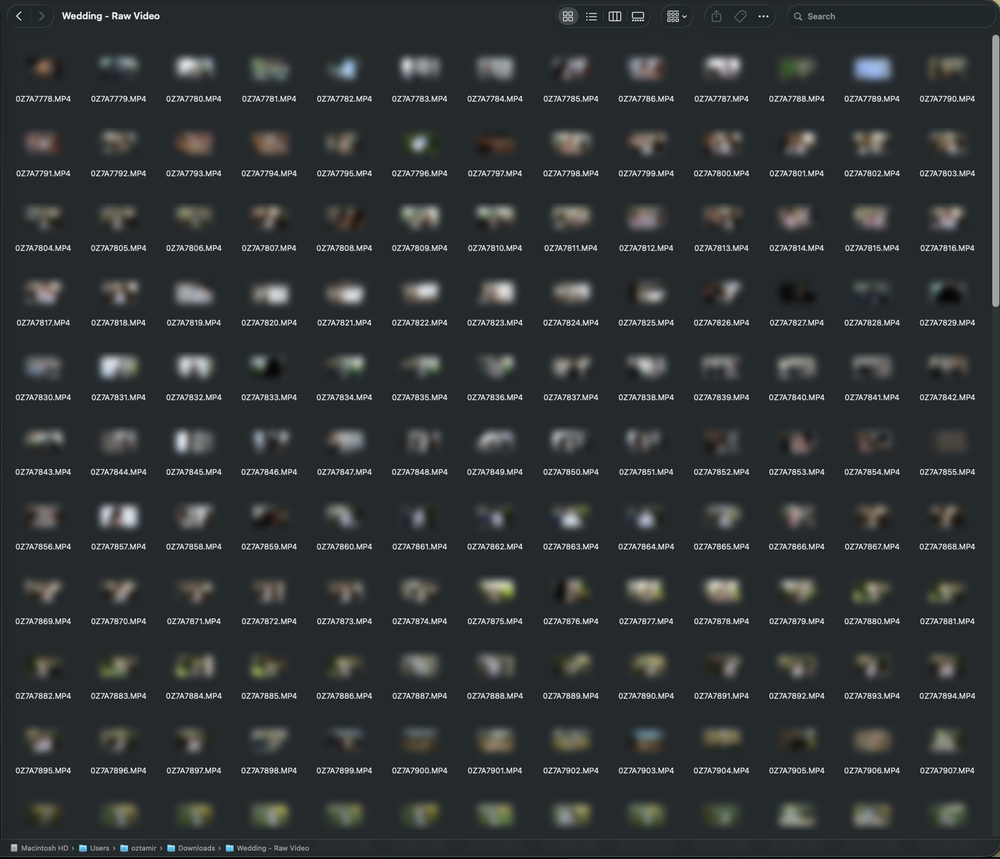
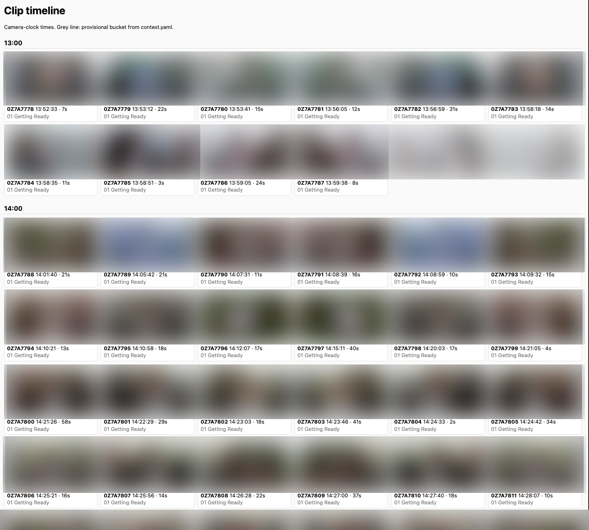
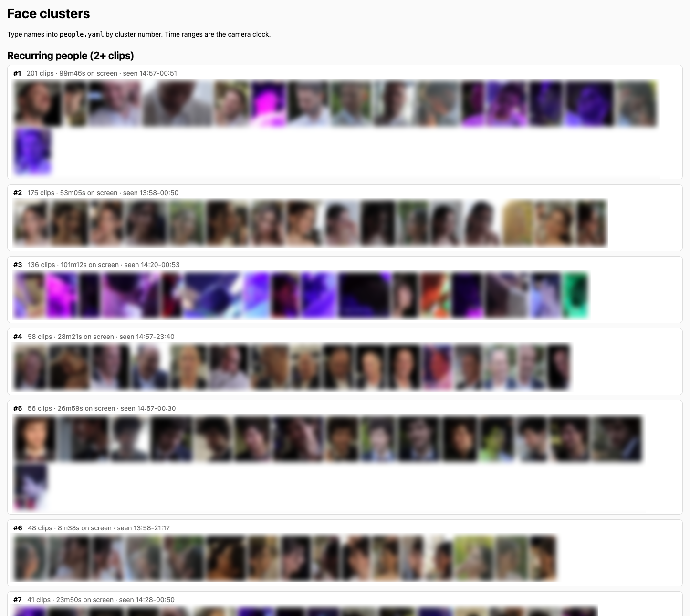
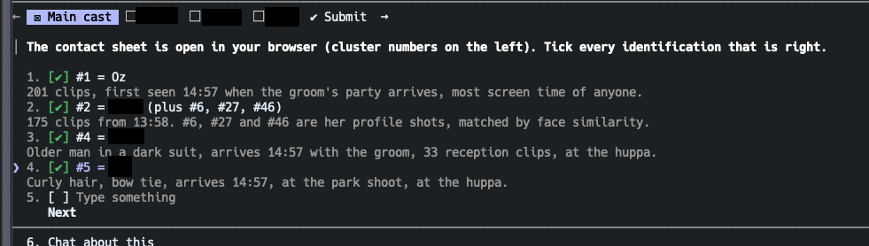
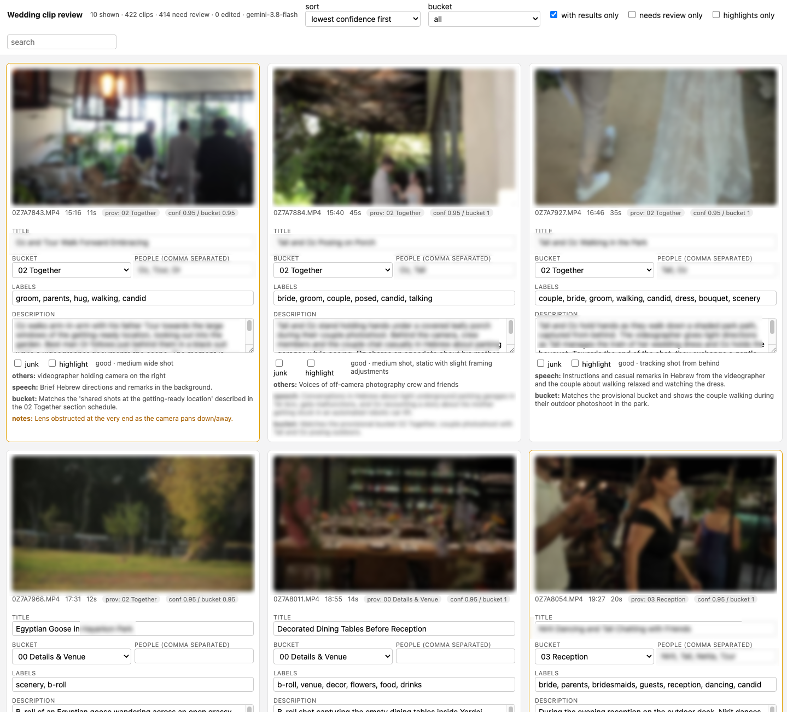
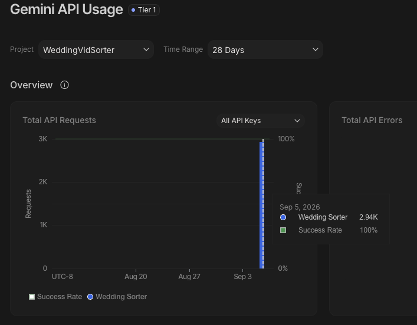
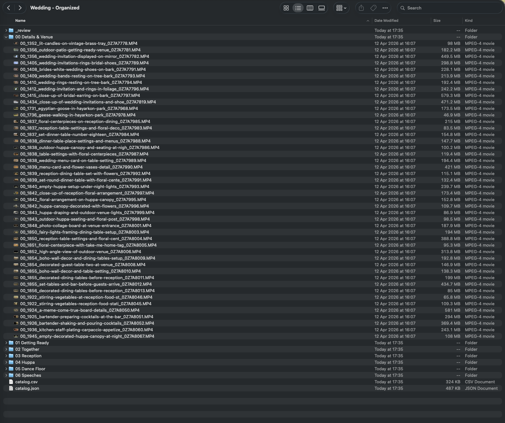

There's a folder sitting in my Downloads called `Wedding - Raw Video`. Our videographer sent it over months ago, and it has been sitting there ever since.

It's a big folder, about 136 GB, which turns out to be around three hours and forty-five minutes of raw footage: every unedited, uncategorized clip our videographer shot on our wedding day.

It was sitting in my Downloads for months because, once I had downloaded it from the file transfer service, I planned to back it up to Google Drive and Apple Photos and delete it from my local drive.

But the first time I opened the folder, and every time I've opened it since (whenever I remember that I need to get it done), I think the same thing: in this shape, I will never be able to find anything in here.

There are no tags, no labels, nothing to search by. If I ever wanted to pull up any specific clip, I'd have to scrub through 422 files with names like `0Z7A7778.MP4`. And if I can't find anything, I'll never go looking.

It would just sit there, in Drive instead of Downloads, never to be opened.


*The before. Good luck finding anything in there.*

So what am I gonna do? Sit down and sort 422 clips by hand? I knew this was what I _needed_ to do, but I kept postponing it. Finally, I could wait no longer: the original download link had expired, and if I didn't do it now, I could lose these files forever if something happened to my computer.

But I still paused - after all, it is a daunting task to catalog so much footage. So instead, I did what any reasonable person would do with an evening to kill and 136 GB of footage: I opened Claude Code.

## The brief

My idea was pretty simple. Take a model that can watch video, run it over every clip, and have it write a short description of what happens in it. I was fairly sure Gemini was the right model for that part. About everything else, I had no idea. So I gave this prompt to Claude (Fable):

> I have a folder with a bunch of videos from my wedding. Raw footage from our videographer, a lot of very short clips. I want to back these up into Google Drive, but before I do, I want to organize it.
>
> I was thinking about using an AI model with video modality to go over each one and create a short description of what happens in it. I'll write a short prompt with context about the day (*here I gave a brief description of the timeline of the day*). I want to give the agent enough context to write descriptions that include the names of the people and the part of the day.
>
> I think Gemini would be the best fit, but if you think otherwise, let me know. The output for each video should be a description, a title (including a possible filename), a few labels, the people in it, and a "bucket" for sorting into folders.
>
> Let me know what you think is the best way to go here.

I also attached a screenshot of how we organized the photos, so it would know which folders I had in mind. That was the whole brief. And then - it cooked.

## What Claude came back with

Before writing a single line of code, Claude went and looked at the footage.

It turned out that all 422 clips came from the same camera, in order, with the recording time intact: the first at 13:52, the last at 00:53. The median clip is 16 seconds long, the longest is eleven and a half minutes, and nine of them are under three seconds (a lens cap, the floor, that kind of thing).

From this it made the first realization I hadn't: the timeline that I had described to it in the prompt? It could tie it back to the timestamps on the files! All I'd need to do is mark where each part starts and ends, and this would give us the split to the folders I had asked for without even involving any AI.

This would also assist in the AI-driven part of the task - the video model would only have to describe what it sees, and override the folder if it had a good reason to.

After running a short search, Claude agreed with me that Gemini is the right pick here, but for a reason I hadn't thought about: it takes the clip together with its audio. The blessings at the ceremony, the parents' speeches, the music, someone shouting a name across the dance floor, all of it tells the model where in the day it is and who's in the shot. With a multimodal model like Gemini, I get all this information without having to perform an additional transcription pass.

It also had no intention of sending 136 GB anywhere. Gemini samples video at one frame per second, so 4K is completely wasted on it. Claude encoded one clip down to 720p as a test, timed it, and estimated about twenty minutes for the whole set on the Mac's hardware encoder.

How did it know all that? For starters, it queried the files to get the information about timestamps and video quality - one `ffprobe` call per file:

```bash
ffprobe -v error -print_format json -show_format -show_streams 0Z7A7778.MP4
```

That's where the recording time, the duration and the resolution come from. The proxies are one `ffmpeg` call per file:

```bash
ffmpeg -i 0Z7A7778.MP4 \
  -vf scale=-2:720 -r 25 \
  -c:v h264_videotoolbox -b:v 2M \
  -c:a aac -b:a 96k -ac 2 \
  -movflags +faststart 0Z7A7778.mp4
```

720p, 25 frames per second, 2 Mbit video and a small stereo audio track. Audio stays in on purpose, since that's half of what Gemini listens to.

Then it laid out the whole thing as a small Python project:

1. Inventory every clip into SQLite with `ffprobe`.
2. Encode the 720p proxies with `ffmpeg`.
3. Assign a provisional bucket to every clip from the camera clock and my schedule.
4. Send each proxy to Gemini with the day's story, the provisional bucket, and the two previous clips' titles for continuity.
5. Get back one JSON record per clip: title, a slug for the filename, description, bucket, labels, people, what's being said, what's playing, a junk flag, a highlight flag, and a confidence score. Resumable, so a crash or a prompt tweak never redoes finished clips.
6. A local review page, sorted by confidence with the doubtful clips first.
7. Copy everything into folders with readable names. Originals untouched.

It priced the run at about five dollars on Gemini Flash and fifteen on Pro, and suggested a ten-clip pilot on both before spending either. It also insisted I use a billed API key rather than the free tier, because only paid-tier data is excluded from Google's training, and made sure every upload gets deleted right after its call.

Sounded good to me. I said yes to all of it. Then it asked about the people.

## Who's who, without telling it who's who

The original plan for the people part was to hand Gemini a few photos of each person and let it match faces. Claude wasn't thrilled about it.

According to some web searches it made, Gemini sometimes refuses to match faces even against photos you supply, and when it does match, there's a real chance it'll confidently name the wrong person. Neither of those is great when the whole point is being able to search for someone.

So it suggested doing the faces locally, with a library called [insightface](https://github.com/deepinsight/insightface). The idea goes like this: sample one frame per second from every proxy, detect every face, and compute a signature for each one. Then cluster the signatures across all 422 clips, so that each cluster is one person. Nobody knows who anyone is at this point, and nothing leaves the Mac. At the end you get a contact sheet, a grid of face crops per cluster, and you type a name next to the handful of clusters you care about. Everyone else is a guest.

The core of it is smaller than it sounds. insightface ships a pretrained model pack called `buffalo_l` that does both detection and recognition, and on a Mac it runs through CoreML:

```python
from insightface.app import FaceAnalysis

app = FaceAnalysis(name="buffalo_l", allowed_modules=["detection", "recognition"],
                   providers=["CoreMLExecutionProvider", "CPUExecutionProvider"])
app.prepare(ctx_id=0, det_thresh=0.5, det_size=(640, 640))

for t, frame in frames_of(proxy_path, fps=1):        # one frame per second, via ffmpeg
    for face in app.get(frame):
        e = face.normed_embedding                    # 512 floats, unit length
        # same person within this clip? cosine similarity against the tracks so far
        best = max(tracks, key=lambda tr: e @ tr.mean(), default=None)
        if best is not None and e @ best.mean() > 0.45:
            best.add(t, e, face)
        else:
            tracks.append(Track(t, e, face))
```

Every face becomes a 512-number vector, and two vectors of the same person point in roughly the same direction. Within a clip, faces that point the same way get merged into one track.

Across clips, the tracks get clustered with plain `AgglomerativeClustering` from `scikit-learn` (cosine distance, average linkage), and each cluster gets a row on the contact sheet. The whole scan over 422 proxies took about fifteen minutes.

While the face scan chewed through the footage in the background, Claude started asking me questions. Following the timestamps from the camera, it created a small HTML timeline page that contained a thumbnail of every clip and its time on the camera clock, and asked me for the first and last clip of each part of the day.

This way, we were able to quickly mark which videos belong in which folder - while there were some misses, this was a super quick way to go about it, and the HTML helper was great.


*The timeline page. I typed in the first and last clip of each part of the day.*

Then the face scan finished, and Claude opened the contact sheet. This was the part that really blew my mind - because Fable was able to guess almost **all** of the relevant people (myself, my wife, our parents, the bridesmaids and best man) only by correlating the faces' appearance times with the timeline I had shared with it.


*Every recurring face in 422 clips, grouped. No names yet.*

Cluster #1 was me: 201 clips, first seen at 14:57, which is exactly when I'd told it the groom's party arrives. Cluster #2 was my wife, first seen at 13:58, plus three more clusters that turned out to be her in profile.

Cluster #4, an older man in a dark suit who arrives at 14:57 with the groom and stands under the huppa: my father. And cluster #5, curly hair, bow tie, arrives at 14:57, tags along to the park for the couple shoot, stands under the huppa: the best man.


*It had the best man before I said a word.*

Nobody told it who the best man was. It worked it out from who shows up when the groom shows up, who comes along to the couple shoot, and who's standing next to us during the ceremony.

I was seriously impressed.
## Letting the cheap model watch my wedding

Once it had all the context it needed, Claude ran the pilot first: ten clips from across the day, on both Gemini Flash and Gemini Pro.

After a round of tightening the prompt (rule number one is now "never guess a name; if you aren't sure, describe the person instead"), both models agreed on all ten, buckets and names included. Flash wrote the richer descriptions and cost a third as much, so Flash it was.

The code it wrote for this part (which I only opened now for the purpose of writing this blog post) is one upload and one call per clip, using the [google-genai](https://github.com/googleapis/python-genai) SDK:

```python
from google import genai
from google.genai import types

client = genai.Client(api_key=os.environ["GEMINI_API_KEY"])

f = client.files.upload(file=proxy_path, config=types.UploadFileConfig(mime_type="video/mp4"))
while f.state.name == "PROCESSING":
    time.sleep(2)
    f = client.files.get(name=f.name)

try:
    resp = client.models.generate_content(
        model="gemini-3.8-flash",
        contents=[types.Content(role="user", parts=[
            types.Part.from_uri(file_uri=f.uri, mime_type="video/mp4"),
            types.Part.from_text(text=prompt),           # clip number, shot time, provisional bucket,
        ])],                                             # detected people, previous two titles
        config=types.GenerateContentConfig(
            system_instruction=system,                   # the day's story, the cast, the rules
            response_mime_type="application/json",
            response_schema=ClipResult,
            media_resolution="MEDIA_RESOLUTION_HIGH",
            temperature=0.4,
        ),
    )
    result = ClipResult.model_validate_json(resp.text)
finally:
    client.files.delete(name=f.name)
```

`ClipResult` is the schema from the plan: title, slug, description, bucket, labels, a list of people (each with a confidence and a *basis*, meaning whether the name came from the local face match, was said out loud, or matched a reference photo), what's said, what's playing, junk, highlight, and an overall confidence.

With the pilot completed, it kicked off the full run: 412 remaining clips, six in parallel, about 40 minutes. I kept reloading the review page and watching the results come in - it was truly a wild experience, since it got every one of them right.


*The review page. Every clip gets a title, a bucket, the people in it, labels, a description, and a note about what's being said.*

The descriptions are better than I expected from the cheap model. It picks up who's talking and what about, what music is playing, and whether the shot is handheld or a gimbal. For anything over a minute, it lists the key moments with timestamps.

After 422 clips (which took about 45 minutes total with the pilot), it was done. Total spend on Gemini, pilots included: about six dollars.


*The whole run, as seen from Google's side. 2.94K requests, zero errors.*

The final result? Eight folders, one CSV and one JSON at the root, and every file renamed to bucket, camera time, title, and the original name, like `00_1352_lit-candles-on-vintage-brass-tray_0Z7A7778.MP4`. All done automatically.

What a time to be alive.


*The after. Drive search will actually find things now.*

## Bonus: baking the catalog into the files

Folder names and a CSV are nice, but the descriptions live next to the files, not in them.

So as a last step I had Claude write everything into the videos themselves as QuickTime metadata, the kind Finder, QuickTime Player and photo apps read.

To do this, Claude used [exiftool](https://exiftool.org/), running a script which looks something like this:

```bash
exiftool -m -P -overwrite_original_in_place \
  "-Keys:Title=Lit Candles on Vintage Brass Tray" \
  "-Keys:Description=A close-up shot of several thick pillar candles resting on an ornate vintage brass tray, with two of them lit and glowing warmly." \
  "-Keys:Keywords=wedding,Details & Venue,decor,close-up,b-roll" \
  "-Keys:CreationDate=2025:10:22 13:52:33+03:00" \
  "-ItemList:Title=Lit Candles on Vintage Brass Tray" \
  00_1352_lit-candles-on-vintage-brass-tray_0Z7A7778.MP4
```

The `Keys` family is what newer Apple software reads, the older `ItemList` family is what Finder and most players show, so both get written. The `CreationDate` with the time zone fixes a small annoyance: the camera wrote local time and flagged it as UTC, so every clip showed up three hours off. Only the container is rewritten, the video and audio streams are untouched, and all 422 files took about six minutes.

## An agent that writes an agent

The whole thing took about two hours end-to-end, and I'd say I was hands-on-keyboard for about ten minutes of it. And to me, this is the coolest part about the whole thing: it did the "boring" part for me. That's what coding agents are for.

1,700 lines of Python got written, none of them by me. I never wrote a prompt for Gemini, never looked at its API, never decided how to handle retries or what the JSON schema should look like. I decided on what I want to do - build a video cataloging agent - and the model took it from there.

I've been saying for a while that AI lets you do things you'd never have spent the time doing before. This project added something to that: you don't even have to think about how to get a model to do the thing. You can ask an agent to write another agent for you, and with how good agents are today - this is probably enough to call it a day.
