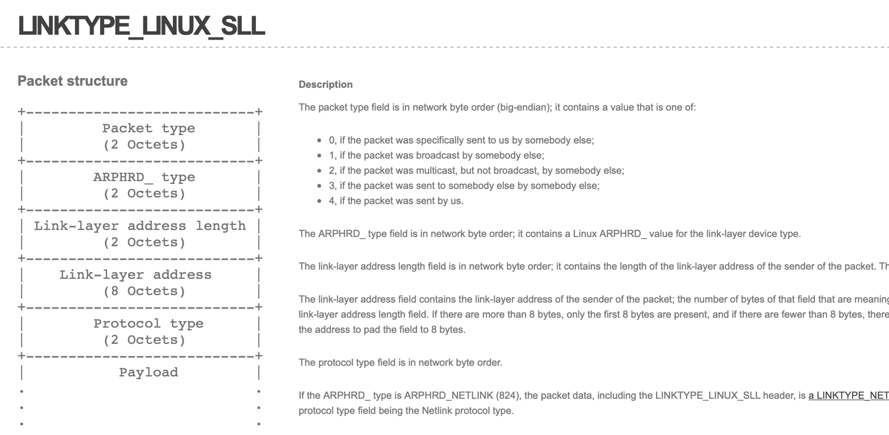
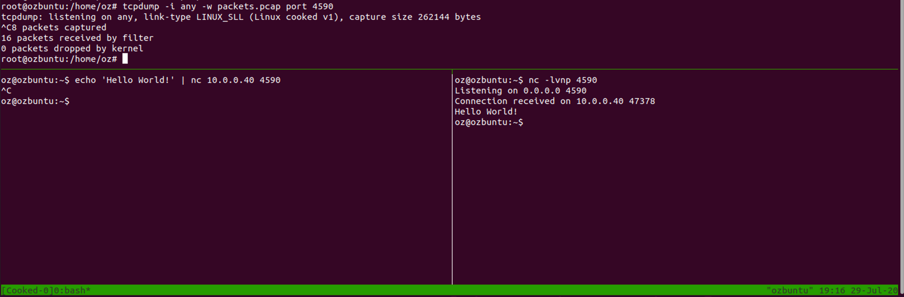
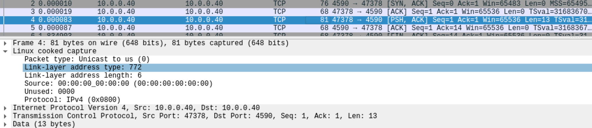

During a recent project I was working on, I found myself in a scenario where I wanted to replay existing network traffic (captured in a PCAP file) onto a network host, in order to reproduce a bug in a program on that host.

During this effort, I found myself dealing with a concept I was not familiar with, called “Linux Cooked Packets”, and I thought I'd write about it as I found it to be clever, hacky, and interesting.

## What _are_ Linux cooked packets?

Imagine the following scenario - you are writing a script, which provides a way to parse incoming HTTP traffic to your machine. You want it to be as generic as possible - so you sniff not only `tcp port 80`, but every packet! But wait - what if your machine has multiple interfaces? For example, on my development machine I have a bunch of virtual machines, and I want to be able to see incoming traffic from all of these.

This is why [libpcap](https://sharkfestus.wireshark.org/sharkfest.11/presentations/McCanne-Sharkfest'11_Keynote_Address.pdf) - which is the leading packet-capturing library for Unix systems (with WinPcap being the non-\*nix implementation) used by tools such as tcpdump and WireShark - provides a pseudo interface, named `any`, which can be used to capture packets regardless of the interface they’ve originated from. This provides a simple and interface-agnostic way to capture the entirety of network traffic coming into your machine, and is useful in many situations.

However, this feature comes at a cost. Since `any` is intended to be, as mentioned, an interface-agnostic solution, it has to also support non standard interfaces - which might all have different link-layer headers.

> For those unfamiliar, link layer is the lowest non-physical network layer in the networking stack. This layer includes information about the way the data in the packet arrived to the machine (for example - the MAC address of the network identity who sent the packet into our computer). This layer contains a variety of different protocols, each of which has a different link-layer header - for example, while most of you are familiar with Ethernet packets used in most household networks, [other link layers protocols](https://tools.ietf.org/html/rfc2364) have a different header - which might be very different from Ethernet (or [very similar](https://en.wikipedia.org/wiki/IEEE_802.11)!)

Because every interface might provide a different link-layer header, libcap’s authors have decided to throw away the real, hardware specific link-layer header, and instead use a pseudo protocol called _Linux cooked-mode capture (SLL)_ .

### Linux cooked-mode capture (SLL)

So let’s take a look at this protocol, described in full details [here](https://www.tcpdump.org/linktypes/LINKTYPE_LINUX_SLL.html).

In order to create a PCAP file containing packets with SLL headers, all you have to do is, as mentioned, to start capturing packets on the `any` interface. For example, here’s a tcpdump command that will capture every packet that has a Layer-4 payload directed at port 4590:

*`tcpdump -i any -w sniff.pcap port 4590`*

Now, let’s take a look at the resulting PCAP file using our favourite packet analyser, Wireshark:

As we can see, despite the packet being sent as a normal, Ethernet based packet, `any` has transformed the header into an SLL header. This SLL header, detailed at the link above, tries to answer the questions most link layer headers answer - Who sent this packet, to whom, and from where (again, for more information - [RTFM ❤️](https://www.tcpdump.org/linktypes/LINKTYPE_LINUX_SLL.html)).

### How is this implemented?

For anyone interested in the nitty-gritty details (like myself), the [Wireshark wiki entry](https://wiki.wireshark.org/SLL) on SLL has a great explanation about the implementation details of this beauty:

> For those who are curious, "SLL" stands for "sockaddr\_ll"; capturing in "cooked mode" is done by reading from a PF\_PACKET/SOCK\_DGRAM socket rather than the PF\_PACKET/SOCK\_RAW socket normally used for capturing. Using SOCK\_DGRAM rather than SOCK\_RAW means that the Linux socket code doesn't supply the packet's link-layer header. This means that information such as the link-layer protocol's packet type field, if any, isn't available, so libpcap constructs a synthetic link-layer header from the address supplied when it does a recvfrom() on the socket. On PF\_PACKET sockets, that address is of type sockaddr\_ll, where "ll" presumably stands for "link layer"; the fields in that structure begin with sll\_.

For more information, the [packet(7)](https://man7.org/linux/man-pages/man7/packet.7.html) man page is indeed a terrific source for information about the internals of this subject and I highly recommend reading it.

## Personal Take

Things like this is why I love computer networking. These days, most of the programming world is working in unexpected ways - most of the problems that you’ll encounter will be the result of solution to older problems solved while ignoring the resulted technical debt.

However, the networking world is so much better in this regard - asking yourself “why this was built” will often also answer “why was this built _this way_” - as most of the problems are for fundamental, logical problems, that are solved without the overhead and complication years of technical debt have created - most solutions to computer networking questions - such as “how can I read packets from all interfaces while taking into account non-standard ones” - have cool answers, like this one.

It just so much fun!
