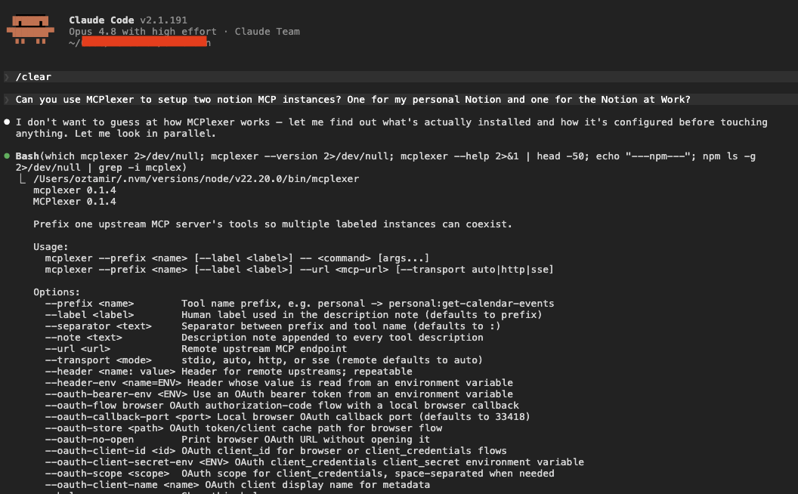
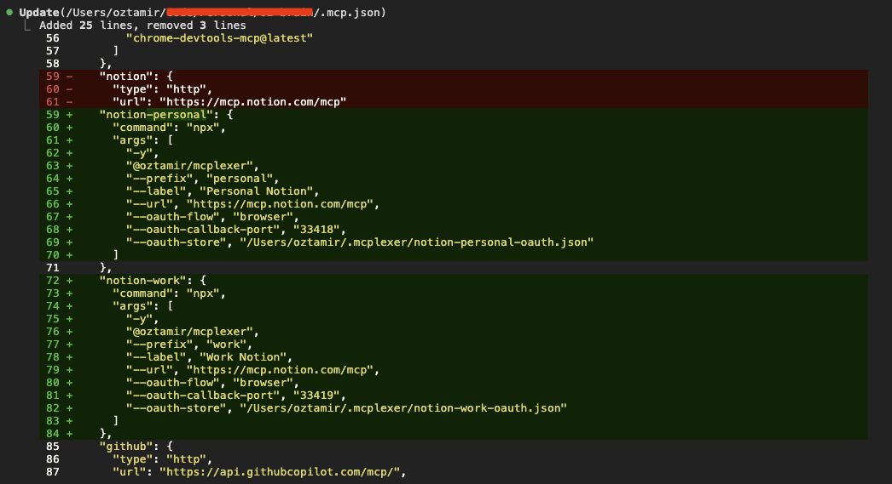
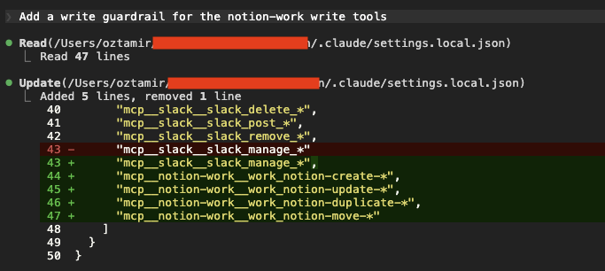

I built a tiny tool called [MCPlexer](https://github.com/OzTamir/mcplexer), and it does exactly one thing: it lets you run more than one instance of the same MCP server at once, without their tools colliding.

It's a small proxy. It sits in front of an MCP server and renames every tool with a prefix you pick. Point it at a server that exposes `get-calendar-events`, give it the prefix `personal`, and your agent sees `personal:get-calendar-events`. Run a second copy with the prefix `work`, and you also get `work:get-calendar-events`.

Same server, two instances, no clashes. The upstream server has no clue it's being wrapped, it still gets plain `get-calendar-events` calls.

## Getting it running

Install it from npm:

```bash
npm install --global @oztamir/mcplexer
```

Then point your MCP client at `mcplexer` instead of the upstream server, and put the real server command after a `--`. Here's two Google Workspace accounts, personal and work, side by side in one `.mcp.json`:

```json
{
  "mcpServers": {
    "google-personal": {
      "command": "mcplexer",
      "args": [
        "--prefix", "personal",
        "--label", "Personal",
        "--", "npx", "-y", "@example/google-workspace-mcp"
      ],
      "env": { "GOOGLE_ACCOUNT": "personal" }
    },
    "google-work": {
      "command": "mcplexer",
      "args": [
        "--prefix", "work",
        "--label", "Work",
        "--", "npx", "-y", "@example/google-workspace-mcp"
      ],
      "env": { "GOOGLE_ACCOUNT": "work" }
    }
  }
}
```

That's the whole setup. Two instances of the same server, cleanly namespaced, and your agent can finally tell them apart.

Don't want a global install? `npx -y @oztamir/mcplexer` works too, and there's a [Claude Code plugin and an agent skill](https://github.com/OzTamir/mcplexer#agent-skill) if you'd rather have your coding agent wire it up for you.

{wide}
*Or just let your coding agent set it up. Every flag is in `mcplexer --help`.*

## Why I built it

This started while I was working on a "Second Brain" agent that I wanted to connect to all surfaces of my digital life. My personal calendar and my work calendar. My personal Notion and my work Notion. Sounds simple, right? It isn't.

Most MCP servers quietly assume you'll only ever run one of them. One Google account, one Notion workspace, one instance per project. I have two of everything, so that assumption broke on day one.

My first instinct was the dumb one: just run the server twice.

So I did. Both copies came up fine, and then promptly clashed. The problem was that they exposed the exact same tools with the exact same names, and the agent had no idea which `create-event` belonged to which account. I asked it to put something on my work calendar and it cheerfully booked it on my personal one instead.

It's not really the agent's fault. Harnesses resolve tools by name, and when two servers both insist they own a tool called `create-event`, there's no deterministic way to tell them apart. Running the server twice doesn't get you two accounts. It gets you one ambiguous mess.

So what about an existing fix? Some MCP servers have multi-account login baked in, which is lovely if you happen to use one of those. There are also a few MCP proxies floating around, but they're heavyweights built for completely different problems, and pulling one in for this felt like renting a forklift to move a chair.

I wanted something light, pointed at this exact problem. So I built it.

## How it works

Under the hood, MCPlexer is itself just an MCP server. Your agent connects to it exactly like it would to any other server, and it never knows anything unusual is going on.

When it starts up, MCPlexer connects to one upstream server (the real one, either a local command or a remote URL) and does two things:

- When the agent asks for the list of tools, MCPlexer fetches the upstream's tools and rewrites each name with your prefix before handing the list back.
- When the agent calls one of those prefixed tools, MCPlexer strips the prefix back off and forwards the call upstream, untouched.

That's the entire idea. The agent only ever sees `personal:create-event`. The upstream only ever sees `create-event`. Neither side knows the other is being fooled.

Here are the two handlers that do it, lightly trimmed from [`proxy.ts`](https://github.com/OzTamir/mcplexer/blob/main/src/proxy.ts):

```ts
// tools/list: ask the upstream, then prefix every tool
server.setRequestHandler(ListToolsRequestSchema, async () => {
  const tools = await listAllTools(upstream.client)
  return { tools: tools.map((tool) => prefixTool(tool, config)) }
})

// tools/call: strip the prefix, forward upstream unchanged
server.setRequestHandler(CallToolRequestSchema, async (request) => {
  const upstreamName = unprefixToolName(request.params.name, config)
  if (upstreamName === undefined) {
    throw new McpError(ErrorCode.InvalidParams, `Tool ${request.params.name} is not managed by this prefix`)
  }
  return upstream.client.request(
    { method: "tools/call", params: { ...request.params, name: upstreamName } },
    CallToolResultSchema,
  )
})
```

And the "rewriting"? It's just a template string:

```ts
function prefixToolName(name: string, options: PrefixOptions): string {
  return `${options.prefix}${options.separator}${name}`
}
```

In fact, the whole prefixing module ([`prefix.ts`](https://github.com/OzTamir/mcplexer/blob/main/src/prefix.ts)) - renaming, un-renaming, and the little note it tacks on - comes to under 40 lines.

MCPlexer also appends a label to each tool's description, so the agent gets a human hint like `Note: this is one of multiple instances of this MCP, labeled "Personal"`. But the heavy lifting is that one line up there.

## Adding remote MCP and OAuth support

I started with local servers, but I quickly decided that for this to be useful, I should support remote MCPs as well. For example, I wanted to use the Notion MCP - which is a remote server you connect to over HTTP, behind a real OAuth login.

Few prompts later, and it's supported! Now, all you have to do is to point MCPlexer at a URL with `--url`, ask for the browser flow, and the config still looks about as boring as the local one:

```json
{
  "mcpServers": {
    "notion-work": {
      "command": "mcplexer",
      "args": [
        "--prefix", "work",
        "--label", "Work Notion",
        "--url", "https://mcp.notion.com/mcp",
        "--oauth-flow", "browser"
      ]
    }
  }
}
```

That boring config hides two problems worth talking about.

The first is transports. MCP has two ways to talk to a remote server, the newer Streamable HTTP and the older SSE, and a given server might speak either one. I didn't want to make you know or care which. So `auto` mode ([`upstream.ts`](https://github.com/OzTamir/mcplexer/blob/main/src/upstream.ts)) tries the modern transport first and falls back to the legacy one:

```ts
async function connectRemoteAuto(config) {
  const http = await tryConnection(() => connectStreamableHttp(config))
  if (http.ok) return http.upstream

  const sse = await tryConnection(() => connectSse(config))
  if (sse.ok) return sse.upstream

  throw new UpstreamConnectionError(config.url, "auto", {
    cause: new AggregateError([http.error, sse.error]),
  })
}
```

The second is OAuth, and most of it isn't my code at all. The MCP SDK exposes an `OAuthClientProvider` interface that handles the protocol mechanics: PKCE, token exchange, refresh.

MCPlexer plugs into that with a tiny local HTTP server that catches the browser redirect, and a file store that caches tokens under `~/.config/mcplexer/oauth/`. On first run it prints the authorization URL, opens it, waits for you to approve, catches the callback, and reconnects. The agent only ever sees the prefixed Notion tools.

The genuinely fiddly bit is specific to this tool. The whole point of MCPlexer is that you run several copies at once: `work:`, `personal:`, maybe more. Browser OAuth needs a loopback redirect like `http://127.0.0.1:<port>/oauth/callback`, and if every instance grabbed the same port they'd collide the second two of them tried to authorize. A random port each time is worse, because plenty of providers pin the redirect URI and reject anything that doesn't match.

So MCPlexer derives the port deterministically, by hashing the upstream URL together with the prefix ([`upstream-config.ts`](https://github.com/OzTamir/mcplexer/blob/main/src/upstream-config.ts)):

```ts
const MIN_DYNAMIC_CALLBACK_PORT = 49152
const MAX_DYNAMIC_CALLBACK_PORT = 65535

function defaultOAuthCallbackPort(raw) {
  const hash = createHash("sha256")
    .update(`${raw.url ?? ""}\n${raw.prefix ?? ""}`)
    .digest()
  const range = MAX_DYNAMIC_CALLBACK_PORT - MIN_DYNAMIC_CALLBACK_PORT + 1
  return MIN_DYNAMIC_CALLBACK_PORT + (hash.readUInt32BE(0) % range)
}
```

Same URL and prefix always land on the same high port, different instances land on different ones, and nobody has to configure anything. `work:` and `personal:` each get their own callback and never step on each other. (Need an exact redirect URI? Pin it with `--oauth-callback-port`.)

{wide}
*One Notion server split into a personal and a work instance, each on its own callback port and token store.*

## Example use case: per-account permissions

Once I was running personal and work instances of the MCP - as two separate, cleanly labeled servers - it handed me something I hadn't planned for: per-account permissions.

Take my two Notion accounts. I'm happy to let my agent create, edit, and move pages in my personal Notion. Go wild. My work Notion is a different story: I want the agent to read it, but I really don't want it rewriting pages my coworkers depend on.

Because each account is its own MCP server, Claude Code can tell them apart, and its [allow/deny permissions](https://code.claude.com/docs/en/permissions) can target one without touching the other. So I asked my agent to add a write guardrail to the work instance, and it dropped the right deny rules straight into my settings:

{wide}
*Blocking just the work Notion account's write tools. Personal stays untouched.*

Notice the tool names. Claude Code rewrites any character that isn't a letter, number, `_`, or `-` to an underscore in permission matchers, so the `work:` prefix lands as `work_`, and the rules wildcard from there (`mcp__notion-work__work_notion-create-*`).

The agent can still read everything in my work Notion, it just can't change it, while my personal Notion stays fully hands-on.

Now try drawing that line when both accounts are crammed into one MCP server sharing a single set of tool names. You can't. There's no separate `notion-create-pages` for work and `notion-create-pages` for personal, there's just `notion-create-pages`, and the moment you deny it you've denied it everywhere. Splitting the accounts into separate, prefixed instances is what makes the distinction expressible at all.

## Known limitations

A couple of things to know before you lean on this.

The big one is shared state. Some MCP servers stash their config or local state at a fixed path on disk. Run two instances of a server like that side by side and they can end up reading and writing the same files, clobbering each other.

The bad news: there's not a lot MCPlexer can do about that from the outside. The good news: most servers let you point their state somewhere else with a flag or an environment variable, and so far that's been enough to run every server I've wanted, two at a time, without trouble.

I haven't actually hit a collision in practice, but it's exactly the kind of thing that bites you quietly, so it's worth knowing about.

The other limitation is on purpose. Right now MCPlexer only proxies tools. It rewrites `tools/list` and `tools/call`, and that's it. The MCP specification also has `resources`, `prompts`, and `notifications`, and none of those get the prefix treatment yet.

Extending it would be straightforward, the same trick applied to a few more request types, but I haven't needed any of it, so I left it out.

If you do, the [repo](https://github.com/OzTamir/mcplexer) is open and I'm happy to take a pull request.

## You can just do things

The most interesting thing here isn't the OAuth port trick or the permission stuff. It's how little there is to MCPlexer at all.

The whole thing is a tiny proxy. It sits between an agent and a server, passes most messages straight through, and rewrites a couple of fields on the way past. That's the whole trick. The core is a few dozen lines, and I built almost all of it in an afternoon, with [Claude](https://www.anthropic.com/claude) doing most of the typing.

When I realized I also wanted remote servers and OAuth, that was another short prompt and another hour. A simple little tool, and it unlocked every multi-account setup I'd been missing.

And that's only possible because of how MCP is shaped. It's a small, uniform protocol, so you can slot a tiny layer into the middle and bend it to do something it didn't do out of the box. Multiplexing is just one of those things. You could rewrite tool descriptions, hide tools you don't want exposed, merge a few servers into one, or gate calls behind your own rules. None of it takes deep magic. It's mostly plumbing.

So if there's a piece of tooling you wish existed in your setup, there's a decent chance you can just build it. No heavy framework, no waiting for someone else to ship it. A small proxy and an afternoon.

You can just do things. This one happened to be [MCPlexer](https://github.com/OzTamir/mcplexer). Go make yours.
