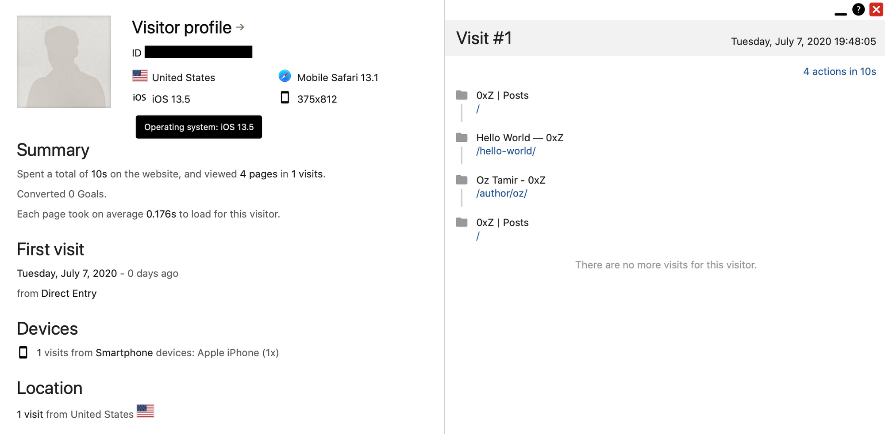
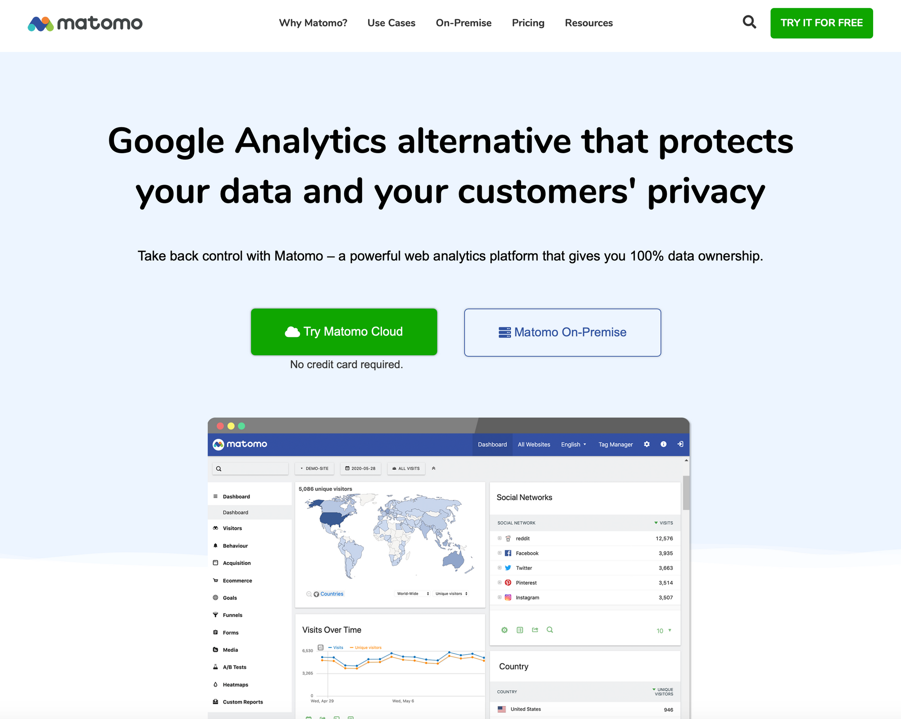
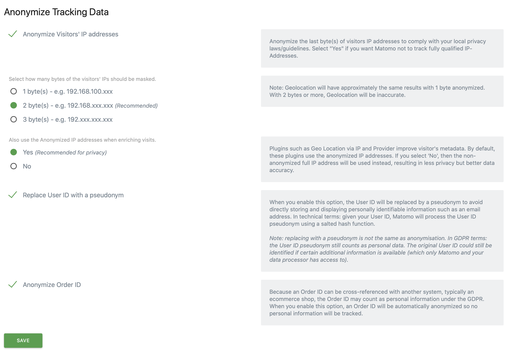

Ever since I started getting into technology, I’ve always been obsessed with tracking metrics - about everything. Tracking how many hours I sleep at night, how many steps did I take today, where I was every hour of the day (I was a HUGH fan of [Moves](https://moves-app.com%20) until it was killed off!) - **EVERYTHING**.

As part of this data craze, obviously one of the first thing I would do after starting a blog is to set up **analytics**. What are analytics? Well, each time you visit a website, Some information about your device is sent by the browser to the server. What data? Here’s an example:

There are three interesting pieces of data in this image (taken, as you can guess, from the analytics server for this site - this is me over there 🙂):

1.  Your IP address - obviously, when you access a server it can know the IP from which the request was sent. This is interesting because using IP GeoLocation, it is possible to know from where you are accessing the site - usually down to the city you’re in. This GeoLocation is based on a database containing all the IP addresses in the world mapped to the owner. If I’m surfing from an IP bought by Bezeq (an Israeli ISP), than I’m probably physically in Israel right now.
2.  Device information - As you can see, the website knows that I was using an iOS device, and using the screen size information it can also have a pretty good estimation of the exact iPhone modal I’m using (Android devices actually send to the server the exact modal without the server having to guess 😕). This is sent in an HTTP header called User-Agent, and it’s usually send in order to allow the site to display different content based on the device you’re using (for example - display mobile site for smartphone users).
3.  The third, and probably the most interesting one, is the ID, which isn’t sent by the client accessing the site but rather is assigned to it by the server upon the first access. This ID is used to follow along as you use the site, and allows the server to figure out “a session” - which is what can be seen on the right side of the screenshot.

As you can see, trackers these days are quite smart - they can track who are, what device are you using, and even where you’re from. And, as always, with great power comes great responsibility.

## Google Analytics isn't for me.

When most people want to measure analytics in their sites or apps, they’d often use Google Analytics, which is Google’s solution to the analytics problem. It’s an easy and convenient solution - it’s free (for small sites, anyway), offers loads of integration with almost every CMS and control panel, and only requires you to sign up with your Google account, add a short JS snippet to your site, and that’s it! No server, no nothing. Great, right? NOPE.

In Google's world, you don't pay for the service - because you (or your customers) are the product. While I don't think that thats not a fair deal, personally It's not a deal I'd like to force over my readers. Google Analytics just isn't for me (for [privacy reasons and others](https://plausible.io/blog/remove-google-analytics#what-are-the-alternatives-to-google-analytics)), but I’m not writing to talk about Google.

So why am I writing? Well, as I said, despite the privacy violations that are inherited in tracking users, I did want at least insights about what’s going on. So I started researching, and that’s when I found out about **Matomo**.

## Matomo

*https://matomo.org/*

Matomo, previously called Pwiki, is an open-source alternative with a focus on data ownership and privacy controls. I use it as a self-hosted system here on my website, since I want 100% control over the data.

### Installation

To install, I’ve followed [this tutorial](https://www.scaleway.com/en/docs/setting-up-web-analytics-with-matomo-on-ubuntu-bionic/) from the folks over at ScaleWay. However, two point for anyone trying to install this:

-   I’m using this over an Nginx setup, and therefor I recommend using [Matomo’s helpful Nginx configuration](https://github.com/matomo-org/matomo-nginx). Notice that you are required to changed some of the variables in the configuration (Most prominent: server\_name variable and PHP socket file).
-   The [official documentation](https://matomo.org/docs/installation/) include an [helpful section](https://matomo.org/faq/how-to-install/faq_23484/) about setting up the required MySQL configuration.

### Why I like Matomo

So let’s talk about why I like Matomo - **PRIVACY**. As I said, I have no intention of spying on my readers, and Matomo respects that. The Matomo server offers privacy tools I haven’t seen anywhere else, from [GDPR](https://en.wikipedia.org/wiki/General_Data_Protection_Regulation) Tools, regular deletion of users access data, and even full on user anonymization tools:

*Yes, these are the actual settings from this site's analytics control panel 🙂*

Of course, There’s a debate to be had over whether or not it’s morally OK to track your users. However, this is a choice I made and I stand behind it, as it allows me to better understand what’s going on in my site. Normally, I would feel a bit bad about it - even though I know that this data isn’t used for anything other then giving me insights about my readers, I would fell bad because a random middleman (GA or others) will also read this data and use it for it’s own purposes. However, with Matomo, I couldn’t think of a better compromise that will allow me to both track what’s happening in my site while simultaneously keeping my reader’s privacy in check.

Hopefully you’ll agree.

* * *

As a side note, if you’re not interested in being tracked at this site you are welcomed to enable your browser’s “Do Not Track” feature or use an ad-blocker, as most of them block Matomo by default.

No hard feelings, I promise.

🙂
