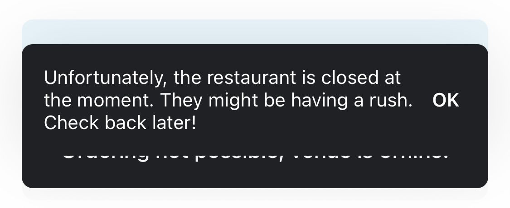

In a [previous post](/writing-telegram-bots-for-fun-and-profit/), I’ve talked about how I found Telegram bots to be a useful utility that can help technological individuals to automate many repetitive workflows without needing to create complex notification systems.

Well, today I used a Telegram bot to do just this.

As a resident of Tel Aviv, I find that on many nights I choose to use Wolt’s delivery service to order food from nearby restaurants. However, I recently became frustrated with an occurrence that I found to be happening almost every time I wanted to order. In Wolt’s system, when a restaurant is dealing with a surge of orders, it can opt to go offline for a short while, which means that no one can create new orders until the restaurant goes back online. That way, restaurants can handle surges without leaving customers frustrated with prolonged delivery times.

This made me frustrated. I wanted to order from a certain restaurant, but it was offline, and worse - even though I was willing to wait for it to come back online, I had to manually check it every few seconds to see if it came back online - this was such an unpleasant user experience, that I chose to close Wolt and make myself dinner instead (maybe this **is** the desired outcome for me? Never mind :P).

This happened a few times, which made me decide that it is time to put my Python skills to use. And what would be a better solution than a telegram bot?

## Introducing WoltWatcher

Which is how WoltWatcher, my latest project, came to be. WoltWatcher is a Telegram bot that receives links to offline Wolt venues and checks every 60 seconds to see if they became online. If the restaurant goes back online, it will notify the user who set the watch by sending a message announcing that the restaurant is now available.

Here’s a demo (with a venue that is online at the time of the check - I didn’t had the patience to wait until rush hours to make this demo :P):

![[telegram-bot-demo.mp4|title=Telegram bot replying to a Wolt order query]]

The bot is available publicly for use [here](https://t.me/WoltWatcherBot), and the source code is available [here](https://github.com/OzTamir/WoltWatcher).

This project was inspired by [this repo](https://github.com/Fraysa/slack_wolt_notifier), which relies upon Slack bots to achieve the same goal.

## Conclusion

Once again, I’ve proven to myself that Telegram bots are just as useful as I thought there are. Which makes me happy. Doing it without this eco-system would’ve required me to create a much bigger infrastructure - including a mobile app, servers to handle the notifications, and so on - and I am very happy that such an easy solution exists.

This was a fun project to spend the afternoon doing. I think it is yet another example of how simple coding skills (as the code here isn’t very complicated) can make a meaningful impact on the small pain-points of our everyday lives. Which is what, in my opinion, what good technology is all about.
