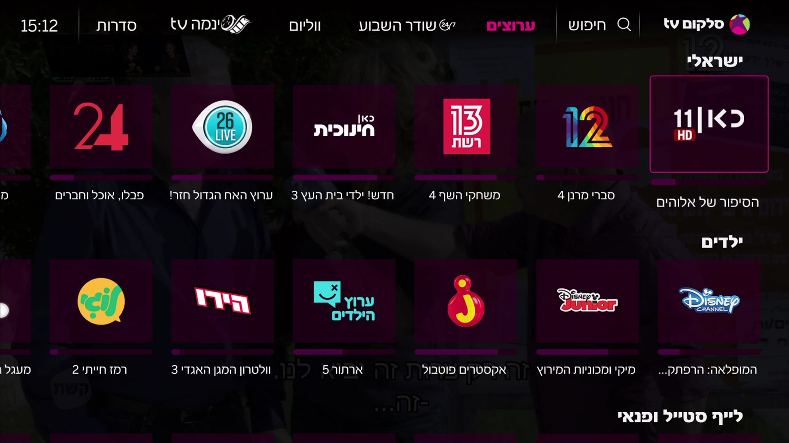
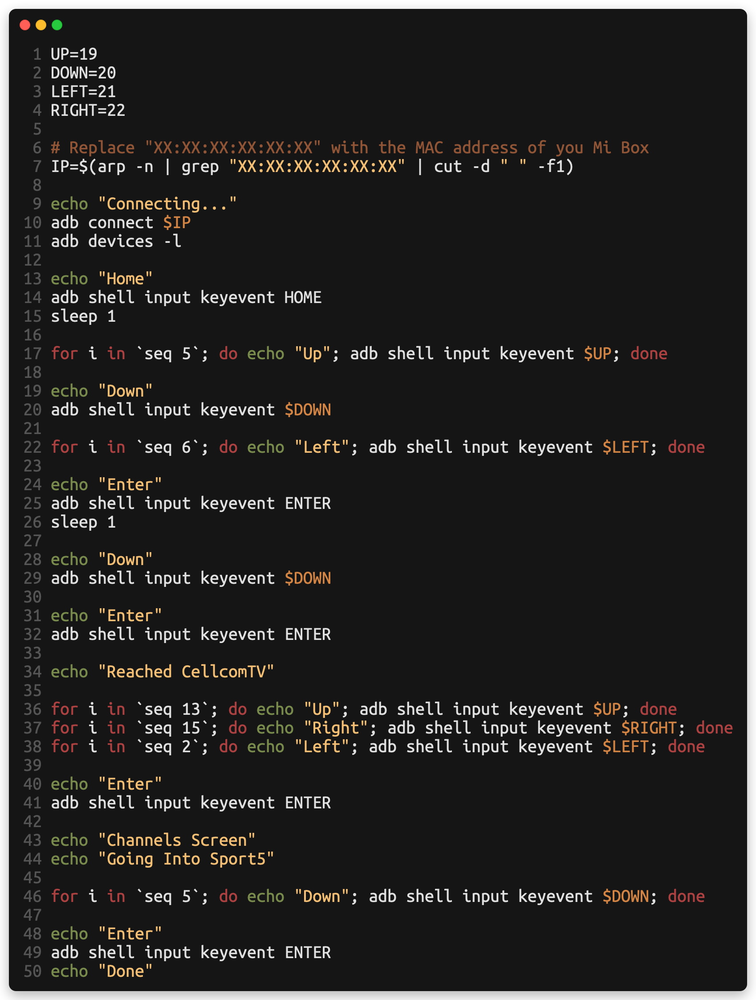
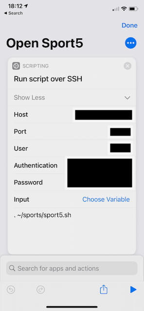
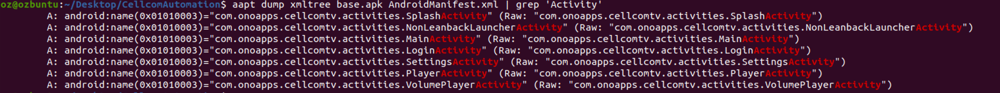
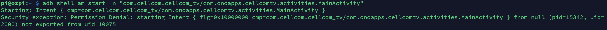

I have a problem - I’m lazy. While this isn’t a problem that I have to face on a day-to-day basis, that _is_ a problem that I am _sometimes_ reminded of. For example - for about a month now I’ve been using an iPhone App to control my Xiaomi Mi Box streamer instead of just buying new batteries for my remote control.

However, there is a caveat - every time I want to watch television, I have to reach to my phone, unlock it, search for the app, open it, wait for it to connect…it’s a hassle. So being the lazy yet tech-oriented person that I am, I had to come up with a solution - and figured out that automation might help in that case (or, you know, buying new batteries - but who would do that?). You see, if all I had to do was to click a single button on my iPhone and it would magically turn on the channel I want to watch - that would be quite nice.

*CellcomTV's Interface*

So let’s get to it. I’m using “Cellcom TV” as my TV provider, and as such my TV “box” is Xiaomi’s Mi Box, running Android 8. That is why I figured I’d start with searching for existing solutions. While I found [some solutions](https://github.com/JeffLIrion/python-androidtv) that seemed to be aimed at solving problems like my own, nothing quite seemed to hit the spot. So I started researching.

## ADB

After doing some reading, I found [this](https://gist.github.com/mcfrojd/9e6875e1db5c089b1e3ddeb7dba0f304) amazing gist by mcfrojd, which seemed to group together a couple of useful and relevant commands. While reading it, and since I have no background on Android development or research, I figured that I need to read a bit about ADB. ADB (which stands for Android Debug Bridge) is a command line tool that is used to communicate with your android device for debugging purposes, which provides a lot of help during development for the Android platform. As [Droidtape](https://www.droidape.com/a-brief-introduction-to-adb-and-fastboot-on-android/) puts it

> Android Debug Bridge (ADB) is a versatile command line tool that lets you communicate with an emulator instance on your PC or connected Android device. It comes bundled with the Android SDK and allows developers to communicate with their device for debugging or taking logs for further analysis. To use ADB, you need to enable USB Debugging on your device which is like an access port that allows users to send commands to the Android via PC.

Enabling ADB on the Mi Box wasn’t difficult, although I was very surprised by the "how to": [apparently](https://stackoverflow.com/a/31436088), in order to enable ADB debugging you go to the “About” screen and repeatedly click on the “Build” label until a message pops up saying that you’ve enabled developer privileges. Coming from the iOS side of the road, this was very strange for me - but I guess that this might be better than the Apple version of enabling developer options (for more info, `cat /dev/null`).

## Poor Man's AutoHotKey

Going back to the gist, I figured that I could just use the `input keyevent` command to send input directions to the TV, which is exactly what I did - using a shell script on the local Raspberry Pi, I wrote the following script (after I figured out the exact key scheme required to reach the desired channel from everywhere in the Cellcom App, regardless of the current position in the app - which makes this a [PIC](https://en.wikipedia.org/wiki/Position-independent_code)!):

*https://gist.github.com/OzTamir/a15ef324d3fdced3a5db9ea57f8bbba6*

And it works! Just like magic, the Mi Box springs to life and start moving itself as if it was hacked. I should mention that all of the key codes defined in the top rows were taken from [here](https://stackoverflow.com/a/8483797). This StackOverflow also led me to [this post](https://www.rightpoint.com/rplabs/automating-input-events-abd-keyevent) which describes something that is very similar to what I did here.

To top it all off, I used the Shortcuts app on my iPhone to turn that into a one-click solution:

And it works! I can keep being lazy.

## Appendix: Simulating Intents and launching Activities using adb (And why it won’t work ☹️)

Once I was done, I got curious and started wondering whether or not it was possible to trigger the intent that opens the channel directly instead of AutoHotKey-ing it. After reading a bit about the subject, I tried to figure out what intentions the CellcomTV apps defines:

{wide}

The only activity that made sense to me as being a suitable candidate for being the Activity responsible for displaying the actual stream was `PlayerActivity`. I decided to play with this idea, and tried to launch activities from adb, but unfortunately:

{wide}

It seems that this activity isn’t exported and as such cannot be triggered from external processes (such as adb). Shame. Anybody got a PE for AndroidTV laying around? Asking for a friend 🙃
